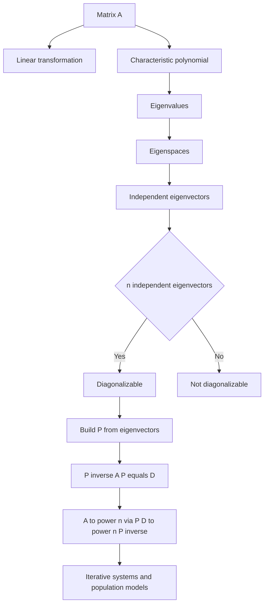

# MA1513 — Chapter 3: Linear Transformation, Eigenvalues and Eigenvectors

> [!summary] Chapter overview
> Chapter 3 treats matrices as **transformations** and develops the ideas of **eigenvalues, eigenvectors, eigenspaces, diagonalizability, diagonalization, and powers of matrices**. The central theme is that a suitable eigenvector basis can turn a complicated matrix into a diagonal matrix, making repeated matrix operations much easier.

---

## 3.1 Linear Transformation

### Matrix as a mapping
For an $m\times n$ matrix $A$, multiplication by $A$ defines a mapping

$$
T : R^n \to R^m \text{ defined by } T(u)=Au \text{ for all } u \in R^n.
$$

- $u \in R^n$ is the **input vector**.
- $Au \in R^m$ is the **output/image**.
- $A$ is the **standard matrix** of $T$.

For the example in the notes, the transformation is interpreted geometrically as a 90° counterclockwise rotation about the origin.

![[Attachments/Linear Transformation Geometry.png]]

### Linear transformation given by a formula
If

$$
T\left(\begin{bmatrix}x\\y\end{bmatrix}\right)
=
\begin{bmatrix}x+y\\2x\\-3y\end{bmatrix},
$$

rewrite the output as

$$
x\begin{bmatrix}1\\2\\0\end{bmatrix}
+y\begin{bmatrix}1\\0\\-3\end{bmatrix}.
$$

Hence the standard matrix is

$$
A=\begin{bmatrix}
1&1\\
2&0\\
0&-3
\end{bmatrix}.
$$

### Images of the standard basis
If $e_1, e_2, \ldots, e_n$ are the standard basis vectors, then

$$
A=(T(e_1)\ T(e_2)\ \cdots\ T(e_n)).
$$

> [!important]
> **The image $T(e_k)$ is the $k$th column of $A$.**

### Linearity properties
For a linear transformation $T$:

$$
T(0)=0,
$$

$$
T(u+v)=T(u)+T(v),
$$

$$
T(cu)=cT(u).
$$

More generally,

$$
T(c_1u_1+c_2u_2+\cdots+c_ku_k)
=c_1T(u_1)+c_2T(u_2)+\cdots+c_kT(u_k).
$$

Thus, if the images of a **basis** of $R^n$ are known, the entire transformation is determined.

### Stacking method
Suppose the images of a basis $u_1, u_2, \ldots, u_n$ are known. Since

$$
Au_i=T(u_i),
$$

stack the input and output vectors as columns:

$$
A(u_1\ u_2\ \cdots\ u_n)=(T(u_1)\ T(u_2)\ \cdots\ T(u_n)).
$$

Because the input vectors form a basis, their stacked matrix is invertible. Therefore

$$
A=(T(u_1)\ T(u_2)\ \cdots\ T(u_n))(u_1\ u_2\ \cdots\ u_n)^{-1}.
$$

![[Attachments/Stacking Method.jpg]]

> [!tip] Exam idea
> When several equations of the form $Au_i=v_i$ are given, **stack them by columns** instead of solving for every entry of $A$ separately.

---

## 3.2 Eigenvalues and Eigenvectors

### Definition
Let $A$ be an $n\times n$ matrix. A **nonzero** vector $x$ is an eigenvector if

$$
Ax=\lambda x
$$

for some scalar $\lambda$. The scalar $\lambda$ is the corresponding **eigenvalue**.

Geometrically, the arrows representing $x$ and $Ax$ are parallel, pointing either in the same or opposite directions.

> [!warning]
> $0$ **can** be an eigenvalue, but the **zero vector can never be an eigenvector**.

If $x$ is an eigenvector associated with eigenvalue $\lambda$, any scalar multiple $kx$ will also be an eigenvector associated with the same eigenvalue $\lambda$.

### Finding eigenvalues
Starting from

$$
Ax=\lambda x,
$$

we obtain

$$
(\lambda I-A)x=0.
$$

A nonzero solution exists exactly when $\lambda I-A$ is singular:

$$
\det(\lambda I-A)=0.
$$

The polynomial

$$
\det(\lambda I-A)
$$

is the **characteristic polynomial**. Its roots are the eigenvalues.

### Useful shortcuts
#### Triangular matrices
For an upper- or lower-triangular matrix, the eigenvalues are exactly the diagonal entries.

#### Singularity

$$
0 \text{ is an eigenvalue of } A \Leftrightarrow \det(A)=0 \Leftrightarrow A \text{ is singular}.
$$

#### Complex eigenvalues
A real matrix may have complex eigenvalues. For example, a characteristic polynomial $\lambda^2+1$ gives

$$
\lambda=\pm i.
$$

---

## 3.3 Eigenspaces

### Definition and computation
For an eigenvalue $\lambda$, solve

$$
(\lambda I-A)x=0.
$$

The complete solution space is the **eigenspace**

$$
E_\lambda \text{ is the solution space of } (\lambda I-A)x=0.
$$

Every **nonzero** vector in $E_\lambda$ is an eigenvector associated with $\lambda$.

![[Attachments/Eigenvalue Workflow.jpg]]

### Standard workflow
1. Compute $\det(\lambda I-A)$.
2. Solve $\det(\lambda I-A)=0$ for all eigenvalues.
3. For each eigenvalue $\lambda_i$, solve
   $$
   (\lambda_iI-A)x=0.
   $$
4. Express the solution as a span to obtain a basis for $E_{\lambda_i}$.

### Identity matrix
For $I_n$,

$$
I_n v=v
$$

for every $v \in R^n$. Thus the only eigenvalue is $1$ and

$$
E_1=R^n.
$$

### Algebraic multiplicity and eigenspace dimension
Suppose

$$
\det(\lambda I-A)
=(\lambda-\lambda_1)^{r_1}\cdots(\lambda-\lambda_k)^{r_k}.
$$

Then $r_i$ is the **multiplicity** of $\lambda_i$, and for an $n\times n$ matrix

$$
r_1+\cdots+r_k=n.
$$

The key inequality is

$$
\dim E_{\lambda_i}\le r_i.
$$

The eigenspace dimension does **not** always equal the multiplicity.

---

## 3.4 Diagonalizable Matrices

### Why diagonalization is useful
If

$$
A=PDP^{-1},
$$

where $D$ is diagonal, then

$$
A^n=(PDP^{-1})^n=PD^nP^{-1}.
$$

Since

where the diagonal entries of $D$ are $\lambda_1, \lambda_2, \ldots, \lambda_n$.

we have

The diagonal entries of $D^n$ are $\lambda_1^n, \lambda_2^n, \ldots, \lambda_n^n$.

This makes large powers of $A$ much easier to compute.

### Definition
An $n\times n$ matrix $A$ is **diagonalizable** if we can find a non-singular matrix $P$ such that

$$
P^{-1}AP=D
$$

for a diagonal matrix $D$.

Equivalently,

$$
A=PDP^{-1}.
$$

### Main diagonalizability criterion

$$
\text{If } A \text{ has } n \text{ linearly independent eigenvectors, then } A \text{ is diagonalizable.}
$$

Thus a $2\times2$ matrix needs 2 linearly independent eigenvectors, a $3\times3$ matrix needs 3, etc.

![[Attachments/Diagonalizability Example.jpg]]

### Two matrix multiplication observations
If

$$
B=(b_1\ b_2\ \cdots\ b_n),
$$

then

$$
AB=(Ab_1\ Ab_2\ \cdots\ Ab_n).
$$

Suppose the diagonal entries of $D$ are $d_1,d_2,\ldots,d_n$. Then

$$
BD=(d_1b_1\ d_2b_2\ \cdots\ d_nb_n).
$$

These observations explain why choosing eigenvectors as the columns of $P$ gives $AP=PD$.

---

## 3.5 Diagonalization

### Algorithm
For an $n\times n$ matrix $A$:

1. **Find all distinct eigenvalues** by solving
   $$
   \det(\lambda I-A)=0.
   $$
2. **Find each eigenspace** by solving
   $$
   (\lambda_iI-A)x=0.
   $$
3. Take bases $S_{\lambda_i}$ for all eigenspaces and combine them:
   $$
   S=S_{\lambda_1} \cup S_{\lambda_2} \cup \cdots \cup S_{\lambda_k}.
   $$
4. Compare the number of basis vectors with $n$:
   - if $|S|<n$, $A$ is **not diagonalizable**;
   - if $|S|=n$, $A$ **is diagonalizable**.
5. If $S=\{u_1,u_2,\ldots,u_n\}$, form
   $$
   P=(u_1\ u_2\ \cdots\ u_n).
   $$
6. Put the matching eigenvalues on the diagonal of $D$ in the **same order as their eigenvectors in $P$**:
   The diagonal matrix $D$ has the matching eigenvalues as its diagonal entries.

Then

$$
P^{-1}AP=D.
$$

![[Attachments/Diagonalization Example.jpg]]

> [!important] Column order matters
> If the columns of $P$ are reordered, the diagonal entries of $D$ must be reordered in exactly the same way.

### Multiplicity test
If

$$
\det(\lambda I-A)=(\lambda-\lambda_1)^{r_1}(\lambda-\lambda_2)^{r_2}\cdots(\lambda-\lambda_k)^{r_k},
$$

then:

- if $\dim E_{\lambda_i}=r_i$ for **every** eigenvalue, $A$ is diagonalizable;
- if $\dim E_{\lambda_i}<r_i$ for **at least one** eigenvalue, $A$ is not diagonalizable.

### Maximum number of distinct eigenvalues
If an $n\times n$ matrix has $n$ **distinct** eigenvalues, then it is automatically diagonalizable because eigenvectors corresponding to distinct eigenvalues are linearly independent.

> [!warning]
> The converse is false: a matrix can be diagonalizable even when eigenvalues repeat. Every diagonal matrix is already diagonalizable.

---

## 3.6 Powers of Matrices

### Iterative systems
An iterative system has states

$$
x_0,x_1,x_2,\ldots
$$

related by

$$
x_k=Ax_{k-1}.
$$

Therefore

$$
x_n=A^nx_0.
$$

If $A=PDP^{-1}$, then

$$
x_n=PD^nP^{-1}x_0.
$$

### Population modelling example
The notes model yearly movement between rural and urban populations:

- $4\%$ of the rural population moves to urban areas;
- $1\%$ of the urban population moves to rural areas.

Thus

$$
A=\begin{bmatrix}0.96&0.01\\0.04&0.99\end{bmatrix} \text{ and } x_n=
\begin{bmatrix}a_n\\b_n\end{bmatrix},
$$

and

$$
x_n=A^nx_0.
$$

For

$$
x_0=\begin{bmatrix}40000\\60000\end{bmatrix},
$$

the notes obtain

$$
x_n=
\begin{bmatrix}
20000(1+0.95^n)\\
20000(4-0.95^n)
\end{bmatrix}.
$$

Since $0.95<1$, when it is raised to a large power, it will be close to $0$.

For large $n$, the rural population is approximately 20,000 and the urban population is approximately 80,000.

Hence the long-term proportions are

$$
20\% \text{ rural and } 80\% \text{ urban}.
$$

![[Attachments/Population Model.png]]

---

## Chapter 3 — Key Connections

## Exam Checklist

- [ ] Can I construct the standard matrix from $T(e_i)$?
- [ ] Can I use linearity to find images of linear combinations?
- [ ] Can I use the stacking method to recover $A$?
- [ ] Can I compute $\det(\lambda I-A)$ and find eigenvalues?
- [ ] Can I find $E_\lambda$ from $(\lambda I-A)x=0$?
- [ ] Do I distinguish eigenvalue multiplicity from $\dim E_\lambda$?
- [ ] Can I decide whether there are $n$ linearly independent eigenvectors?
- [ ] Can I build $P$ and $D$ with matching column/diagonal order?
- [ ] Can I use $A^n=PD^nP^{-1}$ for large powers and iterative systems?

> [!summary] Core formulas
> $$T(u)=Au$$
>
> $$A=(T(e_1)\ T(e_2)\ \cdots\ T(e_n))$$
>
> $$Ax=\lambda x$$
>
> $$\det(\lambda I-A)=0$$
>
> $$E_\lambda \text{ is the solution space of } (\lambda I-A)x=0$$
>
> $$\text{If } A \text{ has } n \text{ linearly independent eigenvectors, then } A \text{ is diagonalizable}$$
>
> $$P^{-1}AP=D$$
>
> $$A=PDP^{-1}$$
>
> $$A^n=PD^nP^{-1}$$
>
> $$x_n=A^nx_0$$
