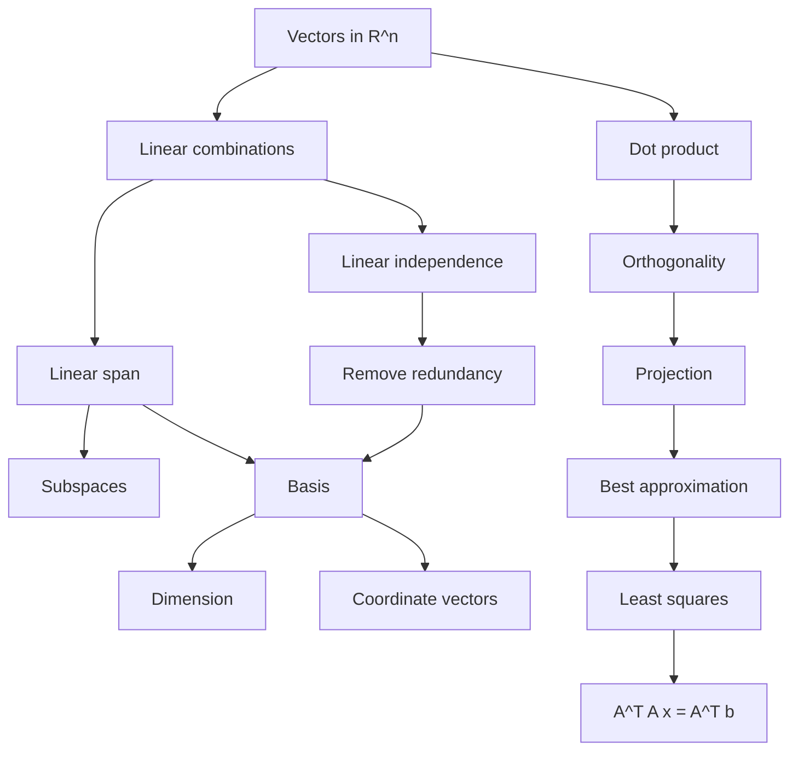

# MA1513 — Chapter 2: Vector Space

> [!summary] Chapter overview
> Chapter 2 develops **vector spaces**, linear combinations and span, subspaces, linear independence, bases and dimension, coordinate vectors, projection, and least-squares approximation.

## 2.1 Vectors in $R^n$

An **$n$-vector** is an ordered tuple
$$
\mathbf u=(u_1,u_2,\ldots,u_n)\in\mathbb R^n.
$$
Vectors may be written as row or column vectors. The **zero vector** is $\mathbf 0=(0,\ldots,0)$.

### Core operations
For $\mathbf u,\mathbf v\in\mathbb R^n$ and scalar $c$:
- Addition: $\mathbf u+\mathbf v$
- Subtraction: $\mathbf u-\mathbf v$
- Scalar multiplication: $c\mathbf u$
- Dot product:
  $$
\mathbf u\cdot\mathbf v=\sum_{i=1}^n u_iv_i.
$$

### Norm, distance, and angle
$$
\|\mathbf u\|=\sqrt{\mathbf u\cdot\mathbf u},\qquad
\|\mathbf u-\mathbf v\|=\sqrt{(\mathbf u-\mathbf v)\cdot(\mathbf u-\mathbf v)}.
$$
For nonzero vectors,
$$
\cos\theta=\frac{\mathbf u\cdot\mathbf v}{\|\mathbf u\|\|\mathbf v\|}.
$$
A vector with norm 1 is a **unit vector**. Two vectors are **orthogonal** when $\mathbf u\cdot\mathbf v=0$.

---

## 2.2 Linear Combination and Linear Span

Given fixed vectors $\mathbf u_1,\ldots,\mathbf u_k$, a **linear combination** is
$$
c_1\mathbf u_1+\cdots+c_k\mathbf u_k.
$$
To test whether $\mathbf v$ is a linear combination of them, solve
$$
c_1\mathbf u_1+\cdots+c_k\mathbf u_k=\mathbf v.
$$
This becomes a linear system. If it is consistent, $\mathbf v$ is a linear combination.

The **linear span** is the set of *all* linear combinations:
$$
\operatorname{span}\{\mathbf u_1,\ldots,\mathbf u_k\}.
$$
Important: a span is generally an infinite set; it is not merely the listed vectors.

### Geometry of span
- One nonzero vector: a line through the origin.
- Two non-parallel vectors: a plane through the origin.
- Standard basis vectors span all of $\mathbb R^n$.

![[Attachments/02_span_basis_overview.png]]

### Standard basis
In $\mathbb R^n$, the standard basis vectors have one component equal to 1 and all others 0. They satisfy
$$
\operatorname{span}\{\mathbf e_1,\ldots,\mathbf e_n\}=\mathbb R^n.
$$

---

## 2.3 Subspaces

A collection $V\subseteq\mathbb R^n$ is a **subspace** when it can be expressed as a linear span. Subspaces satisfy closure:
1. If $\mathbf u,\mathbf v\in V$, then $\mathbf u+\mathbf v\in V$.
2. If $\mathbf u\in V$ and $c\in\mathbb R$, then $c\mathbf u\in V$.

A line/plane representing a subspace must pass through the origin.

### Spaces associated with an $m\times n$ matrix $A$
| Space | Definition | Lives in |
|---|---|---|
| Row space | span of rows of $A$ | $\mathbb R^n$ |
| Column space | span of columns of $A$ | $\mathbb R^m$ |
| Nullspace | all $\mathbf x$ satisfying $A\mathbf x=0$ | $\mathbb R^n$ |

The solution set of a **homogeneous** system $A\mathbf x=0$ is a subspace. The solution set of a general non-homogeneous system $A\mathbf x=\mathbf b$ is not necessarily a subspace.

![[Attachments/03_solution_space.png]]

---

## 2.4 Linear Independence

For vectors $\mathbf u_1,\ldots,\mathbf u_k$, solve
$$
c_1\mathbf u_1+\cdots+c_k\mathbf u_k=\mathbf0.
$$
- **Linearly independent:** only the trivial solution $c_1=\cdots=c_k=0$.
- **Linearly dependent:** a non-trivial solution exists.

Dependence means at least one vector is **redundant**: it can be written as a linear combination of the others.

![[Attachments/01_linear_independence_color_mixing.png]]

### Fast tests
- Two vectors are dependent iff one is a scalar multiple of the other.
- If there are $k>n$ vectors in $\mathbb R^n$, they must be dependent.
- For exactly $n$ vectors in $\mathbb R^n$, put them as columns of an $n\times n$ matrix $A$:
  $$
\det(A)\neq0 \iff \text{independent},\qquad
  \det(A)=0 \iff \text{dependent}.
$$

### Geometric meaning
- Two independent vectors in $\mathbb R^2$ span $\mathbb R^2$.
- Three independent vectors in $\mathbb R^3$ do not lie in one plane and span $\mathbb R^3$.

---

## 2.5 Basis and Dimension

A set $S=\{\mathbf u_1,\ldots,\mathbf u_k\}$ is a **basis** for vector space $V$ if:
1. it spans $V$, and
2. it is linearly independent.

Thus a basis is a non-redundant set of building blocks for the space. The **dimension** is the number of vectors in any basis:
$$
\dim(V)=k.
$$
Any $n$ linearly independent vectors in $\mathbb R^n$ form a basis for $\mathbb R^n$.

### Finding a basis for a span
If
$$
V=\operatorname{span}\{\mathbf u_1,\ldots,\mathbf u_k\},
$$
form $A=[\mathbf u_1\ \cdots\ \mathbf u_k]$, row-reduce it, and identify pivot columns. **Use the corresponding columns of the original matrix $A$** as the basis vectors.

![[Attachments/04_basis_linear_span.png]]

### Row-space basis
The **nonzero rows of a row echelon form** form a basis for the row space.

![[Attachments/05_basis_row_space.png]]

### Column-space basis
Use the **pivot columns in the row echelon form to identify the corresponding original columns of $A$**.

> Exam trap: do **not** use the pivot columns of the echelon form itself as a basis for the original column space.

### Rank and nullity
$$
\dim(\operatorname{Row}(A))=\dim(\operatorname{Col}(A))=\operatorname{rank}(A).
$$
$$
\dim(\operatorname{Null}(A))=\operatorname{nullity}(A).
$$
For a matrix with $n$ columns:
$$
\boxed{\operatorname{rank}(A)+\operatorname{nullity}(A)=n.}
$$
The nullity also equals the number of free variables/parameters in the general solution of $A\mathbf x=0$.

---

## 2.6 Coordinate Vectors

If $S=\{\mathbf u_1,\ldots,\mathbf u_k\}$ is a basis for $V$, every $\mathbf v\in V$ has a **unique** expression
$$
\mathbf v=c_1\mathbf u_1+\cdots+c_k\mathbf u_k.
$$
The coordinate vector of $\mathbf v$ relative to $S$ is
$$
(\mathbf v)_S=(c_1,c_2,\ldots,c_k).
$$

A basis therefore acts as:
- a set of building blocks,
- a unit of measurement,
- a coordinate system.

Changing the basis changes the coordinates even though the underlying vector remains the same. The order of basis vectors also matters.

![[Attachments/08_basis_coordinate_system.png]]

### Typical question types
**Given $\mathbf v$, find $(\mathbf v)_S$:** solve for the coefficients in the basis expansion.

**Given $(\mathbf v)_S$, recover $\mathbf v$:** directly form the stated linear combination of basis vectors.

---

## 2.7 Projection and Linear Approximation

Let $V$ be a subspace of $\mathbb R^n$ and $\mathbf u\in\mathbb R^n$. A vector $\mathbf p\in V$ is the **projection** of $\mathbf u$ onto $V$ if
$$
\mathbf u-\mathbf p
$$
is orthogonal to every vector in $V$.

The projection is the closest vector in the subspace:
$$
\|\mathbf u-\mathbf p\|\le \|\mathbf u-\mathbf v\|\quad\text{for every }\mathbf v\in V.
$$
Hence $\mathbf p$ is the **best approximation** of $\mathbf u$ in $V$.

![[Attachments/07_projection_subspaces.png]]

---

### Least Squares Solutions

For an inconsistent system
$$
A\mathbf x=\mathbf b,
$$
there is no exact solution. A **least squares solution** $\mathbf u$ minimizes
$$
\|A\mathbf u-\mathbf b\|.
$$

### Normal equations
To find a least squares solution, solve
$$
\boxed{A^TA\mathbf x=A^T\mathbf b.}
$$
The normal-equation system is consistent. Any solution is a least squares solution of the original system.

![[Attachments/06_least_squares_example.png]]

### Connection to projection
If $\mathbf u$ is a least squares solution, then
$$
A\mathbf u=\mathbf p,
$$
where $\mathbf p$ is the projection of $\mathbf b$ onto the **column space of $A$**.

This works because every vector $A\mathbf x$ is a linear combination of the columns of $A$, so $A\mathbf x\in\operatorname{Col}(A)$.

---

## Chapter 2 — Key Connections

## Exam Checklist

- [ ] Can I test whether a vector belongs to a span?
- [ ] Can I identify row space, column space, and nullspace?
- [ ] Can I test linear independence using a homogeneous system?
- [ ] Can I find bases for row, column, span, and null spaces?
- [ ] Can I use $\operatorname{rank}(A)+\operatorname{nullity}(A)=n$?
- [ ] Can I find coordinate vectors relative to a basis?
- [ ] Can I interpret projection as best approximation?
- [ ] Can I solve $A^TAx=A^Tb$ for a least-squares solution?

> [!summary] Core formulas
> $$\mathbf u\cdot\mathbf v=\sum_i u_iv_i$$
>
> $$\|\mathbf u\|=\sqrt{\mathbf u\cdot\mathbf u}$$
>
> $$\cos\theta=\frac{\mathbf u\cdot\mathbf v}{\|\mathbf u\|\|\mathbf v\|}$$
>
> $$\mathbf u\perp\mathbf v\iff\mathbf u\cdot\mathbf v=0$$
>
> $$\operatorname{rank}(A)+\operatorname{nullity}(A)=n$$
>
> $$A^TAx=A^Tb$$
