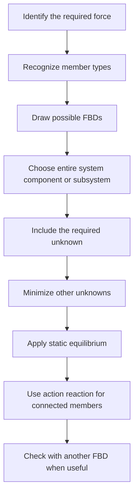

# ME1103 — Chapter 4: Analysis of Frame/Machine

> [!summary] Chapter overview
> This chapter develops the static analysis of **frames and machines**, which are pin-jointed assemblies containing at least one **multi-force member**. The main method is to construct suitable FBDs of the **entire system**, **individual components**, and/or **sub-systems**, while correctly representing pin forces and two-force members. The chapter then introduces **dry friction (Coulomb)**, static and kinetic friction coefficients, impending motion, and applications to machines.

---

## 4.1 Frames and Machines

### Characteristics
- **Frames and machines** are structures connected by **pin joints** and contain at least one **multi-force member**.
- A multi-force member is subjected to **more than two forces applied at different locations**.
- **Frames** are usually rigid structures designed to support loads; they do not collapse when isolated.
- **Machines** contain moving parts and are designed to **transmit and/or modify the effect of forces**.

![[Attachments/Frame and Machine Examples.png]]

### Multi-force and two-force members
In the crane example:
- $ABCD$ and $CEF$ are multi-force members.
- $BE$ is a two-force member.
- For multi-force members, the associated pin force can be represented by **two components** in the 2D plane.
- When the assembly is separated into components, forces at a common pin appear as **action-reaction pairs** on the respective FBDs.

![[Attachments/Crane Component FBDs.png]]

> [!important]
> A two-force member has forces acting along the member axis. Recognizing two-force members reduces the number of unknown force directions.

### Where should a pin be placed in an FBD?
If **no external force acts directly on the pin**, other than internal forces from the connected members:
- the pin may be associated with either connected member;
- it may also be omitted as a separate body;
- the force transferred between the members is unchanged.

![[Attachments/Pin Joint Force Transfer.png]]

If an **external force acts directly on the pin**:
- the pin must be included in the analysis;
- it can be associated with only one of the connected components;
- place it so that the internal force to be determined is revealed in the FBD and can be solved directly.

![[Attachments/External Force on Pin.png]]

### Choosing the system to analyse
The typical approach is to perform static analyses on one or more of:
1. the **entire system**;
2. its **components**;
3. its **sub-systems**.

![[Attachments/Analysis FBD Choices.png]]

For each FBD, up to **three independent equations** can be obtained from static analysis.

> [!tip] FBD selection
> Choose an FBD that contains the unknown force you need while keeping the total number of unknowns small enough to solve using the available static-equilibrium equations.

---

## 4.2 Worked Examples — Frames and Machines

### Example 4.1 — Pin in a smooth slot
The two-member structure is connected at $C$ by a pin fixed to $BDE$ and passing through a **smooth slot** in $AC$.

Because the slot is smooth, pin $C$ exerts a **normal force on the slot**.

![[Attachments/Example 4.1 FBDs.png]]

Using the FBD of member $AC$:

$$
-600+F_C(5)=0
$$

$$
F_C=120\ N
$$

Since only two forces act on member $AC$, the reaction at $A$ is equal and opposite to $F_C$. Therefore, the magnitude of the reaction at $A$ is

$$
120\ N
$$

For member $BCE$, taking moment about $D$:

$$
500(6)+\frac{3}{5}(120)(3)+E_y(2)=0
$$

$$
E_y=-1608\ N
$$

and

$$
\sum F_x=0,\qquad \frac{4}{5}(120)+E_x=0
$$

$$
E_x=-96\ N
$$

Hence,

$$
E=\sqrt{1608^2+96^2}=1611\ N
$$

> [!important]
> The reaction at $E$ can also be obtained from the FBD of the **entire assembly**. The example demonstrates that different valid FBD choices can lead to the same result.

### Example 4.2 — Members connected by a pin and a two-force link
Members $ACE$ and $BCD$ are connected at $C$ and by link $DE$.

![[Attachments/Example 4.2 FBDs.png]]

From the entire-frame FBD:

$$
\sum M_A=0,\qquad -(480)(100)+B(160)=0
$$

$$
B=300\ N
$$

$$
\sum F_x=0,\qquad B+A_x=0\Rightarrow A_x=-300\ N
$$

$$
\sum F_y=0,\qquad A_y-480=0\Rightarrow A_y=480\ N
$$

Geometry gives

$$
tan\alpha=\frac{80}{150}\Rightarrow \alpha=28.07^o
$$

Since $DE$ is a two-force member, its force acts along its axis. For member $BCD$:

$$
\sum M_C=0,\qquad (F_{DE}sin\alpha)(250)+(300)(60)+(480)(100)=0
$$

$$
F_{DE}=-561\ N
$$

$$
\sum F_x=0,\qquad C_x-F_{DE}cos\alpha+300=0\Rightarrow C_x=-795\ N
$$

$$
\sum F_y=0,\qquad C_y-F_{DE}sin\alpha-480=0\Rightarrow C_y=216\ N
$$

The same values can be checked using member $ACE$. The force at $C$ reverses direction between the two component FBDs because the forces are an **action-reaction pair**.

### Example 4.3 — External force applied directly to a pin
A $600\ N$ horizontal force is applied directly to pin $A$.

Members $AB$ and $CD$ are two-force members, so their forces act along their lengths.

![[Attachments/Example 4.3 Two Force Members.png]]

From the entire assembly:

$$
\sum M_E=0,\qquad -(600)(1.0)+F_y(0.6)=0\Rightarrow F_y=1000\ N
$$

$$
\sum F_y=0,\qquad E_y+F_y=0\Rightarrow E_y=-1000\ N
$$

When pin $A$ is attached to member $ACE$, static equilibrium gives

$$
F_{AB}+0.25F_{CD}=-650
$$

and

$$
F_{CD}-F_{AB}=2600
$$

Solving simultaneously:

$$
F_{AB}=-1040\ N,\qquad F_{CD}=1560\ N
$$

> [!warning]
> When an external force acts directly on a pin, the pin placement in the component FBD matters. The lecture also shows an alternative placement with pin $A$ attached to member $AB$; this introduces pin-force components but gives the same final member forces.

### Example 4.4 — Pin sliding freely in a slot
The pin at $C$ can slide freely along the slot. Therefore, the pin force at $C$ is a **normal force perpendicular to $AC$**.

For the entire frame, taking moment about $F$:

$$
-E_y(1.8)+10sin45(1.5)-10cos45(0.6)-12(0.3)=0
$$

$$
E_y=1.536\ kN
$$

For member $BCD$:

![[Attachments/Example 4.4 Slot Force.png]]

$$
\frac{1}{\sqrt5}F_C(1.2)-12(1.8)=0
$$

$$
F_C=40.25\ kN
$$

$$
B_x+10cos45+\frac{2}{\sqrt5}F_C=0\Rightarrow B_x=-43.07\ kN
$$

$$
B_y-10sin45+\frac{1}{\sqrt5}F_C-12=0\Rightarrow B_y=1.071\ kN
$$

Finally, for member $ABE$:

$$
\sum M_A=0,\qquad E_x(1.8)-1.536(0.9)+1.071(0.6)+43.07(1.2)=0
$$

$$
E_x=-28.30\ kN
$$

$$
\sum F_x=0,\qquad A_x+43.07-28.30=0\Rightarrow A_x=-14.77\ kN
$$

$$
\sum F_y=0,\qquad A_y-1.071+1.536=0\Rightarrow A_y=-0.465\ kN
$$

### Example 4.5 — Compound-lever pruning shears
For the cutting blade $ACE$, taking moment about $C$:

$$
300(8)+\left(\frac{2.75}{4.257}F_{AB}\right)(7)+\left(\frac{3.25}{4.257}F_{AB}\right)(2.5)=0
$$

$$
F_{AB}=-373.2\ N
$$

For the lower handle, taking moment about $D$:

$$
-P(17.5)+\left(\frac{2.75}{4.257}(373.2)\right)(3.75)-\left(\frac{3.25}{4.257}(373.2)\right)(1.25)=0
$$

$$
P=31.31\ N
$$

> [!tip]
> This example shows how a machine can **modify the effect of forces** through connected members: analyse the component where the known cutting force acts, obtain the internal link force, then use that force on the handle FBD.

### Example 4.6 — Shear mechanism
Member $BD$ is a two-force member.

![[Attachments/Example 4.6 Member ABC.png]]

For member $ABC$, the lecture defines

$$
\vec r_{B/C}=-0.03\vec i+0.045\vec j
$$

$$
\vec r_{A/C}=(-0.03-0.3cos30^o)\vec i+(0.045+0.3sin30^o)\vec j
$$

$$
=-0.2898\vec i+0.195\vec j
$$

and

$$
\vec F_{BD}=F_{BD}\left(-\frac{25}{65}\vec i-\frac{60}{65}\vec j\right)
$$

$$
\vec F_{400}=400(-sin30^o\vec i-cos30^o\vec j)
$$

$$
=-200\vec i-346.4\vec j
$$

Taking moment about $C$ gives

$$
F_{BD}=-3097.6\ N
$$

Then

$$
C_x=-991.4\ N,\qquad C_y=-2512.9\ N
$$

For the cutting blade, the guide reaction $R$ is horizontal because the blade slides freely along the guiding plate. From vertical force equilibrium:

$$
F_E-\frac{60}{65}(3097.6)=0
$$

$$
F_E=2859\ N
$$

### Example 4.7 — Hydraulic-lift table
The complete mechanism FBD contains four unknowns and is not suitable for directly finding the cylinder force. The mechanism is therefore **dismembered into components**.

![[Attachments/Example 4.7 Component FBDs.png]]

Among the component FBDs, two-force members $AD$, $BC$, and $CG$ define force directions. Member $BDE$ contains the cylinder force, but additional unknowns are first obtained from the platform $ABC$ and roller $C$.

For platform $ABC$:

$$
F_{AD}=0,\qquad B+C=\frac{W}{2}=500g
$$

For roller $C$:

$$
\frac{C}{F_{CB}}=tan\theta\Rightarrow F_{CB}=0.57735C
$$

For triangle $DEH$:

$$
DH^2=0.7^2+3.2^2-2(0.7)(3.2)cos60^o
$$

$$
DH=2.914
$$

and

$$
\frac{sin\varphi}{3.2}=\frac{sin60^o}{2.914}
$$

$$
\varphi=72.0^o\ or\ 108^o
$$

Taking moment about $E$ for member $BDE$ leads to

$$
0.9511F_{DH}=B+C=500g
$$

$$
F_{DH}=5157\ N
$$

---

## 4.3 Friction

### Dry friction
Earlier contact surfaces were treated as **frictionless**, giving:
- only a normal force at the contact surface;
- free sliding between the two surfaces.

In reality, **dry friction (Coulomb)** develops at contact interfaces when the surfaces attempt to move relative to one another.

- Friction acts **tangentially** to the contact surface.
- It **resists motion**.
- Its magnitude is **limited** and depends on the condition of the interface.

![[Attachments/Dry Friction Interface.png]]

### Static and kinetic friction
Experimental evidence shows that frictional force is directly proportional to the normal component of the reaction at the surface.

![[Attachments/Friction Force Behaviour.png]]

The lecture defines

$$
F_m=\mu_sN
$$

and

$$
F_k=\mu_kN
$$

where:
- $\mu_s$ is the **static friction coefficient**;
- $\mu_k$ is the **kinetic friction coefficient**.

The illustrated stages are:
1. **No friction**.
2. **No motion** when the applied tangential force is below $F_m$.
3. **Motion impending** when the friction force reaches $F_m$.
4. **Motion** with kinetic friction $F_k$.

> [!important]
> Use $F_m=\mu_sN$ at **impending motion**. Once motion occurs, the lecture uses $F_k=\mu_kN$.

### Inclination test for $\mu_s$
For a block on an incline:

$$
\frac{F}{N}=\frac{Wsin\theta}{Wcos\theta}=tan\theta
$$

As the angle is increased until the block just starts to slide downward, the angle is $\phi_s$ and the friction has reached its maximum $F_m$.

Therefore,

$$
\frac{F_m}{N}=\mu_s=tan\phi_s
$$

![[Attachments/Inclination Test.png]]

---

## 4.4 Worked Examples — Friction in Machines

### Example 4.8 — Tongs lifting a concrete block
A $500\ N$ concrete block is lifted by a pair of tongs. The objective is to determine the smallest allowable $\mu_s$ at contacts $F$ and $G$.

For sub-assembly $CABD$, symmetry gives

$$
C_x=D_x,\qquad C_y=D_y
$$

and

$$
C_y=D_y=250\ N
$$

Since $AC$ and $BD$ are two-force members:

$$
\frac{C_x}{C_y}=\frac{90}{75}\Rightarrow C_x=300\ N
$$

For tong link $CEG$:

![[Attachments/Example 4.8 Tong FBD.png]]

$$
300(105)+250(135)+250(157.5)-G_x(360)=0
$$

$$
G_x=290.625\ N
$$

From force equilibrium of the block,

$$
G_y=250\ N
$$

At the minimum allowable static friction coefficient,

$$
G_y=\mu_sG_x
$$

so

$$
\mu_s=\frac{G_y}{G_x}=\frac{250}{290.625}=0.860
$$

### Example 4.9 — Hydraulic drum brake
#### (a) Smallest cylinder force to prevent rotation
At impending motion, the drum FBD gives

![[Attachments/Example 4.9 Drum FBD.png]]

$$
0.25(F_L+F_R)-100=0
$$

$$
F_L+F_R=400\ N
$$

The lecture uses

$$
F_L=\mu_sN_L=0.4N_L\Rightarrow N_L=2.5F_L
$$

$$
F_R=0.4N_R\Rightarrow N_R=2.5F_R
$$

For the left arm, taking moment about $A$:

$$
F_{HC}(0.15)+F_L(0.15)-N_L(0.45)=0
$$

$$
F_L=0.1538F_{HC}
$$

For the right arm:

$$
F_R=0.1177F_{HC}
$$

Therefore,

$$
0.1538F_{HC}+0.1177F_{HC}=400
$$

$$
F_{HC}=1473\ N
$$

#### (b) Couple required for clockwise rotation at constant speed
The drum is now rotating, so kinetic friction is used. The moment relation is

$$
M=0.25(F_L+F_R)
$$

For a cylinder force of $3\ kN$, the arm analyses give

$$
F_L=333.3\ N
$$

and

$$
F_R=272.7\ N
$$

Finally,

$$
M=0.25(333.3+272.7)=151.5\ N.m
$$

> [!note] Source notation
> The slide for part (b) displays the kinetic-friction relations and then uses $N_L=3.3333F_L$ and the corresponding factor in the arm equilibrium. The results above follow the worked values shown in the lecture slides.

---

## Chapter 4 — Analysis Strategy

### Frame and machine checklist
- [ ] Identify all **two-force** and **multi-force** members.
- [ ] For a two-force member, place the force along the member axis.
- [ ] For a pin on a multi-force member, represent the pin force with two components when required.
- [ ] If an external force acts directly on a pin, include that pin in the analysis and associate it with one component.
- [ ] For a smooth slot, use only the force **normal to the slot**.
- [ ] Decide whether the entire assembly, a component, or a sub-system gives the most useful FBD.
- [ ] Ensure the force being solved for actually appears on the chosen FBD.
- [ ] Use action-reaction pairs consistently between component FBDs.
- [ ] Use up to three independent static-equilibrium equations for each planar FBD.

### Friction checklist
- [ ] Identify the normal contact force $N$.
- [ ] Draw friction tangential to the contact surface and opposing the attempted or actual motion.
- [ ] At impending motion, use $F_m=\mu_sN$.
- [ ] During motion, use $F_k=\mu_kN$.
- [ ] For the inclination test at impending sliding, use $\mu_s=tan\phi_s$.
- [ ] In machine problems, combine the friction relation with FBDs of the drum, links, arms, or other components.

> [!summary] Core relationships
> **Frames and machines:** use FBDs of the entire system, components, and/or sub-systems, with pin forces forming action-reaction pairs.
>
> **Smooth slot:** contact force is normal to the slot.
>
> $$F_m=\mu_sN$$
>
> $$F_k=\mu_kN$$
>
> $$\mu_s=tan\phi_s$$
