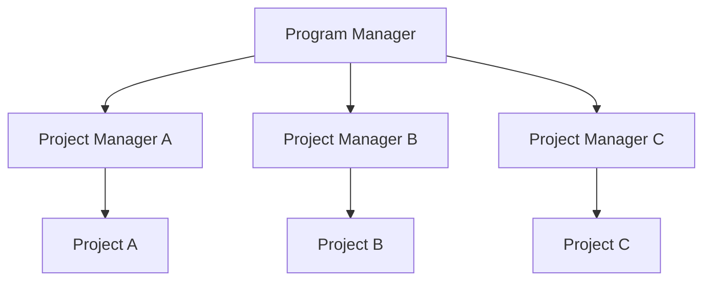
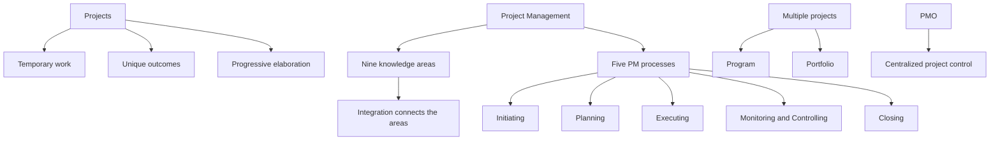

# PF1101A — Chapter 1: Introduction to Project Management

> [!summary] Chapter overview
> Chapter 1 introduces **project management**, explains why projects and project-management skills are important, describes the defining features of **projects**, and introduces the **nine project-management knowledge areas** and **five project-management processes**. It also distinguishes **projects, programs, portfolios, and the Project Management Office (PMO)**.

---

## Learning Outcomes

At the end of this lecture, you should be familiar with:

1. Project Management Knowledge Areas
2. Why projects are important
3. What are projects?
4. Definition of project management
5. Nine knowledge areas
6. Project management application areas
7. What is Program Management?
8. What is Portfolio Management?
9. What is Project Management Office (PMO)?

---

## Why Projects and Project Management Are Important

- Most workplace changes are implemented through **projects**.
- Solving major societal, environmental, and technological challenges requires projects.
- Projects turn **ideas, strategies, and designs into tangible outcomes**.
- Projects enable organisations to **innovate, improve, and adapt**.
- Effective project management helps deliver intended outcomes within **time, cost, and resource constraints**.

### Project performance

The lecture highlights that projects can still perform poorly in the areas of **cost, time, and scope**:

- **48%** of projects are not completed on time.
- **43%** of projects are not completed within budget.
- **52%** of projects experience scope creep.
- Poor project performance wastes **9.9% of every dollar invested**, roughly **US$2 trillion a year globally**.

> [!important]
> Project management is presented as a practical professional capability because organisations need people who can deliver projects well.

### Project management as a career asset

- Project management is **core professional work, not admin**.
- Cost, time, scope, and stakeholders influence whether designs are built as intended.
- Project-management skills are **portable** across construction, manufacturing, technology, consulting, finance, R&D, and other fields.
- The lecture highlights growing global demand for project professionals and encourages students to begin building project capability through internships, student projects, and this course.

### Accidental Project Managers

**Accidental Project Managers** take responsibility for a project without formal project-management training.

They often arise when technical specialists, designers, or engineers are asked to lead an initiative. They may need to coordinate:

- people,
- tasks,
- budgets,
- schedules,
- stakeholders,

while still performing their main professional role.

Without suitable methods and tools, they may face **unclear scope, delays, cost overruns, and stakeholder conflict**. Basic project-management knowledge helps them plan systematically, manage risks, and communicate effectively.

---

## Case Study: Apple iPhone Project

The lecture uses the Apple iPhone project to illustrate project-management ideas:

- Project Purple started in **2004**.
- The iPhone debuted in **2007**.
- Development costs were stated as **$150m**, excluding the ideation phase.

### Lessons highlighted

1. **Ideation phase** — keep early experimentation low-profile with small teams rather than launching a full project for every possible idea.
2. **Project sponsor** — Steve Jobs was fully engaged, allocated resources, and made decisions.
3. **Time** — the 2007 MacWorld Trade Show created a fixed launch deadline and strong team focus.
4. **Human Resources** — talented individuals were deployed to Project Purple.
5. **Quality obsession** — emphasis was placed on how the iPhone looked, felt, and was used.
6. **Proactive risk management** — alternatives were considered, including an iPod phone, a touch-tablet with phone capability, or both.
7. **Communication** — outside communication was forbidden while team communication was described as outstanding.

![[Attachments/Apple iPhone Project Lessons 1-2.png]]

![[Attachments/Apple iPhone Project Lessons 3-7.png]]

---

## 1. Project Management Knowledge Areas

### What is Project Management?

The lecture introduces project management as involving:

- **Application of knowledge**
- **Use of processes**

Project-management work typically involves:

- **Competing demands**
- **Stakeholders**
- **Identified requirements**

The lecture also describes project management as both **Arts and Science**:

- **Arts:** Human Resource, Communications, etc.
- **Science:** Quality, Risks, etc.

### Five project-management processes

The five PM processes are:

1. **Initiating**
2. **Planning**
3. **Executing**
4. **Monitoring & Controlling**
5. **Closing**

![[Attachments/Five PM Processes.png]]

> [!important]
> The PM processes are implemented in each knowledge area.

### Nine knowledge areas supported by five processes

The lecture summarizes project management as a **“9-to-5 job”**: nine knowledge areas supported by five processes.

![[Attachments/Nine Knowledge Areas and Five Processes.png]]

---

## 2. What Others Say About Project Management?

The lecture shows that project-management literature covers recurring topics such as:

- work breakdown and coding,
- cost estimating,
- planning,
- scheduling,
- implementation,
- purchasing,
- cost management,
- changes,
- managing progress,
- project management as a process,
- risk,
- project adaptation,
- keeping on track,
- close-down phases.

It also presents project-management bodies of knowledge from organisations including the **International Project Management Association**, **Association for Project Management**, and **Project Management Institute**.

---

## 3. What Are Projects?

Projects are described as **temporary assignments** that **create something** and operate with considerations such as:

- deadlines,
- resources,
- budget,
- scope,
- results.

Upon completion, the **project team disbands**.

Projects may produce longer deliverables such as skyscrapers and cars, while events may last only a few hours. Both are temporary rather than day-to-day operations.

![[Attachments/What Are Projects.png]]

### Projects create unique products, services, or results

Examples in the lecture include:

- **Things:** skyscrapers, glass, laptops, cameras, etc.
- **Services:** a new call center, better processes, etc.
- **Results:** R&D cure for new viruses.

Projects remain **unique** because factors such as **stakeholders, time, and environment** differ, even when the same type of project is performed many times.

### Progressive Elaboration

**Progressive Elaboration** refers to the refinements that project components pass through to reach their final state.

The illustrated progression includes:

- Project concept
- Project research
- Project concept refinement
- Project concept clarification
- Project feasibility study
- Project scope
- Project plan

The lecture emphasizes that **iteration is a constant**.

![[Attachments/Progressive Elaboration.png]]

### Projects versus Operations

| Projects | Operations |
|---|---|
| Short-term endeavors | Day-to-day work |

### Projects and Strategic Planning

Reasons why a project is created include:

- **Market opportunities**
- **Special needs**
- **Customers**
- **Technology**
- **Law and regulations**

---

## 4. Definitions of Project Management

The lecture describes project management through the following ideas:

- **Supervision and control of the work required**
- **Schedules, monitors, and controls project tasks**
- **The Project Team**
- **9 knowledge areas**, with **Integration** bringing all areas together

> [!important]
> **Project Integration Management** ensures stakeholders know what is going on at all times.

---

## 5. Nine Knowledge Areas

| Knowledge Area | Key Question |
|---|---|
| **1. Integration Management** | What needs to be coordinated and integrated? |
| **2. Scope Management** | What must be done? |
| **3. Time Management** | When should it be done? |
| **4. Cost Management & Finance** | How much will it cost and who will fund it? |
| **5. Quality Management** | How good should it be? |
| **6. Human Resource Management** | Who will do the work? |
| **7. Communications Management** | How will information be delivered? |
| **8. Risk Management** | What problems may be encountered? |
| **9. Procurement Management** | What resources must be obtained? |

![[Attachments/Nine Knowledge Areas Questions.png]]

### Knowledge areas and processes together

The five PM processes are applied across the knowledge areas, while **Integration** connects the areas across the project.

![[Attachments/Knowledge Areas and Processes Matrix.png]]

---

## 6. Project Management Application Areas

### Different disciplines and industries

The lecture states that the **project-management approach is the same** across different disciplines and industries, including:

- IT,
- manufacturing,
- finance,
- consulting,
- R&D,
- etc.

### Understanding the Project Environment

Project environments are influenced by:

- **Physical environment**
- **Cultural and social environment**
- **International and political environment**

### General Management Skills

Project management relies on general management skills such as:

- **Planning**
- **Organizing**
- **Controlling**

### Interpersonal Skills

The lecture also highlights:

- **Problem solving**
- **Motivating**
- **Communicating**
- **Influence the organization**
- **Leadership**
- **Negotiations**

---

## 7. What is Program Management?

**Program Management** involves managing **multiple projects all working towards a common goal**.

- A **program comprises multiple projects**.
- Project managers manage each project within the program.
- The project managers report to the **Program Manager**.

![[Attachments/Program Management Structure.png]]

### Structure

---

## 8. What is Portfolio Management?

The lecture describes a **portfolio** as another way of grouping projects:

- Projects can be grouped into a **portfolio instead of a program**.
- A portfolio is a **collection of projects doing the same things**.
- A portfolio could sit within **one line of business or organizational strategy**, such as boutique hotels.

![[Attachments/Portfolio Management Structure.png]]

> [!note]
> The lecture distinguishes the grouping logic: a **program** contains multiple projects working towards a **common goal**, while a **portfolio** can collect projects within the same line of business or organisational strategy.

---

## 9. What is Project Management Office (PMO)?

The **Project Management Office (PMO)**:

- organizes and manages control of **all projects in the company**,
- provides an advantage over **decentralized project management**,
- enables centralization of areas such as **risks, communications, procurement, etc.**

---

## How Effort Changes Across the PM Processes

The lecture shows that the level of effort changes across the project rather than remaining constant.

- **Define:** goals, specifications, tasks, responsibilities, etc.
- **Plan:** schedules, budgets, resources, risks, HR, etc.
- **Execute:** performance reports, changes, quality, forecasts, etc.
- **Close:** train customers, document transfers, release resources, evaluation, lessons learned.
- **Monitor & control throughout** the project.

![[Attachments/Different Efforts in PM Processes.png]]

---

## Chapter 1 — Key Connections

## Exam / Revision Checklist

- [ ] Can I explain why projects and project management are important?
- [ ] Can I state the main characteristics of a project?
- [ ] Can I distinguish **projects** from **operations**?
- [ ] Can I explain **Progressive Elaboration**?
- [ ] Can I name all **nine knowledge areas** and state the key question for each?
- [ ] Can I name the **five PM processes** in order?
- [ ] Can I explain how the five processes relate to the nine knowledge areas?
- [ ] Can I identify the environmental, general-management, and interpersonal factors relevant to project management?
- [ ] Can I distinguish a **program** from a **portfolio**?
- [ ] Can I explain the purpose of a **PMO**?
- [ ] Can I connect the Apple iPhone case-study lessons to project-management concerns such as time, human resources, quality, risk, communication, and project sponsorship?

> [!summary] Core ideas
> - **Projects** are temporary and create unique products, services, or results.
> - Project work operates within considerations such as **deadlines, resources, budget, scope, and results**.
> - **Progressive Elaboration** refines project components until their final state.
> - Project management uses **nine knowledge areas** supported by **five processes**.
> - The five processes are **Initiating, Planning, Executing, Monitoring & Controlling, and Closing**.
> - **Integration Management** brings the project-management areas together.
> - A **program** manages multiple projects working towards a common goal.
> - A **portfolio** groups projects within the same line of business or organisational strategy.
> - A **PMO** centralizes project control across the company.
