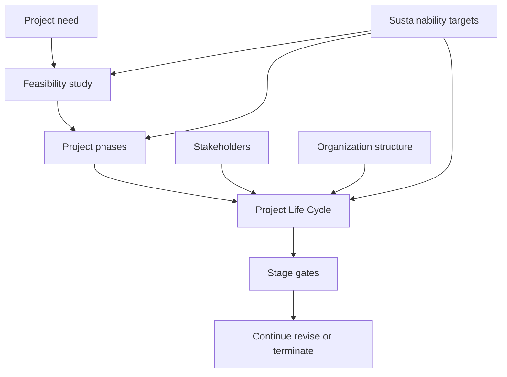

# PF1101A — Chapter 2: Project Life Cycles, Stakeholders, Organizations & Sustainability

> [!summary] Chapter overview
> Topic 2 explains how projects are broken into **phases**, how these phases form a **Project Life Cycle (PLC)**, how **stage gates** control advancement, how **stakeholders** influence projects, how projects fit within **organizations and organization structures**, and how **sustainability** should be incorporated into project decisions.

---

## Case Study — Airbus A380 Project

The Airbus A380 illustrates the scale and complexity that project management must handle.

- Project started in **2000**, with first delivery initially planned for **2002**.
- European cooperation included:
  - Germany — fuselage
  - France — cockpit
  - Britain — wings
  - Holland — wing flaps
  - Spain — horizontal stabilizer tail-plane
- Development and production costs: **US$25 billion**.
- Double-deck aircraft for **800 passengers**.
- Involved about **1,000 companies worldwide** and many engineering disciplines.

### Development problems
- Long wingspan.
- Engine maintenance costs doubled.
- More fuel and CO2 emissions.
- Airport infrastructure requirements included gates, taxiways, reinforced runways, hangars and maintenance equipment.
- Demand shifted away from large aircrafts.

### Project management problems
- Complex supply chain.
- Avionics and systems compatibility issues.
- Miscommunications and integration challenges.
- Territorial politics.
- Teams worked in different countries and spoke different languages.
- Changes to plans and work were not communicated effectively.
- Example: German wiring was unfit for the French wing profile.
- Common vision, values and beliefs were missing.

The project hoped to sell **750 planes**. Initial orders were 50 planes from six airlines. The first delivery to Singapore Airlines was in **2007**, and only **251 planes** were delivered in total. Production was halted in **2021**.

> [!important] Project-management lesson
> A technically ambitious project can still face major difficulties when supply chains, systems, teams, communication and integration are not managed effectively.

---

## 1. Project Phasing

**Project phases make up the Project Life Cycle.**

For larger projects with more uncertainty, the project can be broken down into manageable phases. This allows the project team to view the project as a whole while focusing on completing one phase at a time.

### Main ideas
- One phase is normally completed before the next phase begins.
- **Fast-tracking** may be used when time is an issue.
- Larger projects with more uncertainties can be divided into manageable phases.
- The overall project remains visible even while attention is focused on the current phase.

### MRT example
The lecture gives the following typical phases for building a mass rapid transit line:

1. **Feasibility studies** — 24 months.
2. **Detailed engineering study** — 22–24 months.
3. **Construction** — 48–60 months.
4. **Architectural and M&E works** — 2–3 years.
5. **Testing & Commissioning** — 6–8 months.

![[Attachments/MRT Project Phases.png]]

> [!tip] Revision idea
> Remember the relationship: **project phases → together form the Project Life Cycle**.

---

## 2. Project Life Cycle (PLC)

> [!important]
> Projects have similar PM activities, but **PLCs vary**.

### Project Feasibility Studies
Feasibility studies happen at the **initiating processes** to determine whether the need can be met. A feasibility study can itself be a **stand-alone project**.

The outcome of a feasibility study tells us:

- Is the concept worth moving forward?
- Can the concept be mapped into a project?
- What is the expected cost needed?
- What is the expected time needed?
- What are the costs and benefits if implemented?
- Does the concept meet organizational needs?

### Working through a PLC
A PLC comprises phases. For each phase, consider:

- work completed in the phase;
- resources needed;
- expected deliverables;
- expected costs to complete the phase;
- risks associated with the phase.

![[Attachments/PLC Components.png]]

### General behaviour through the PLC
- Phases are generally **sequential**.
- Costs increase as the project progresses.
- Risks decrease towards the project end.
- The project is more likely to fail at the beginning.
- Changes are easier at the start.
- Changes become less easy at completion.

![[Attachments/PLC Risk Cost Change.png]]

### Example PLC — new camera / invention
The lecture gives this sequence of phases:

1. Proof-of-concept.
2. First build.
3. Proto-type manufacturing.
4. Final build.
5. Operational transfer.

### Project Phase Deliverables
**Every phase has deliverables.**

At the end of a project phase, the project team is accountable for:

- project performance;
- project team performance;
- proof of deliverables;
- verification of deliverables;
- deciding whether the project reaches a kill or finishing point;
- deciding whether the project progresses to the next phase.

### Possible Ways to Terminate a Project

| Method | Meaning |
|---|---|
| **Extinction** | The project ends outright because it succeeded, or because it failed and is stopped. |
| **Addition** | The project becomes a new, permanent part of the organization, such as a new unit or function. |
| **Integration** | The project outputs are absorbed into normal operations and existing teams. |
| **Starvation** | The project is effectively ended by cutting off budget, staff or other resources. |
| **Suspension** | The project is paused or shelved, with the option to restart later. |

The lecture also shows that projects may be **killed**, **revived**, or placed in an **impasse / suspended** state.

---

## 3. Stage Gates

A **stage gate** occurs at the end of a project phase. The gate keeper determines whether the project can move into the next phase.

### How stage gates work
- Performance and deliverables are reviewed.
- If requirements are satisfied, the project can continue to the next phase.
- If metrics are not met, the project is not allowed to move forward.
- The project may be terminated or sent for revisions.

![[Attachments/Stage Gates.png]]

### Decisions at a stage gate
Possible questions include:

- Terminate?
- Progress to the next phase?
- Reuse some parts?
- Acceptance and payments?

> [!warning]
> In a later phase, a project becomes **more difficult to terminate** because there is more to lose.

### Exit criteria
Phase completion leads to phase exit. Exit criteria can include:

- customer’s sign-offs;
- inspections and audits;
- quality metrics;
- performance metrics;
- security metrics;
- end of project phase requirements.

---

## 4. Project Stakeholders

**Stakeholders** are actively involved in or affected by project outcomes.

- They may be **internal or external**.
- They may like, love or hate the project.
- Stakeholders should be identified and the project should be aligned with their expectations.
- Their expectations should be written down quickly.

### How stakeholders influence projects
Stakeholders can influence projects through:

- political capital;
- change requests;
- additions to project scope;
- sabotage.

### Key Project Stakeholders
The lecture identifies:

- Project manager.
- Project sponsor.
- Project customer.
- Vendor.
- Project management team.
- Project team, including consultants.
- Influencers.
- Project Management Office.
- Authorities.

### A380 stakeholder example

![[Attachments/A380 Stakeholders.png]]

| Stakeholder | Main interests | Influence |
|---|---|---|
| Airbus / EADS leadership & shareholders | Commercial success, profitability, market position against Boeing, reputation | Very High |
| Airline customers — e.g. Singapore Airlines, Emirates | Delivery on time, aircraft performance, operating economics, customised cabin requirements | Very High |
| Airbus engineering & manufacturing teams | Feasible design, integration of systems, quality, schedule and technical requirements | High |
| Key suppliers & partners | Clear specifications, stable design, timely decisions and payment, successful integration | High |
| Aviation regulators — EASA / FAA | Safety, airworthiness and regulatory compliance before commercial operation | Very High |
| Airports & infrastructure operators | Ability to accommodate the A380 safely and efficiently at gates, taxiways and terminals | Medium |
| Passengers / travelling public | Safety, comfort, reliability and attractive travel experience | Low direct influence |

### Application to the GRPP utilitarian project
Important considerations include:

1. What are you and who do you represent?
2. Are you part of the government, MNCs, SMEs, NGOs, start-ups, etc.?
3. This determines your access, or lack of access, to existing resources that affect development of the various project plans.

---

## 5. Organizational Models & Attributes

Projects exist within larger entities.

- Projects are components of larger entities, such as HDB, and create something unique.
- Larger entities such as universities, companies and communities directly influence projects.
- Projects **support the larger entities, not replace them**.

### Organization layers
The lecture separates organizational work into three broad layers:

- **Executive** — vision and strategy; answers **“Why?”**
- **Functional management** — tactics; answers **“What?”**
- **Operations** — day-to-day work; answers **“How?”**

![[Attachments/Organization Layers.png]]

### Where projects and operations fit
The teaching example shows:

- **Executive level** — strategy and direction; answers “Why?”
- **Business / functional level** — capabilities, resources and standards; answers “What?”
- **Delivery level** — projects and operations; answers “How?”

At the delivery level:

- **Projects** are temporary and produce unique outcomes.
- **Operations** are ongoing and repetitive work.
- Projects draw resources from the organization and support recurring work.

---

## 6. Different Organization Structures

The organization structure affects the **Project Manager’s authority**.

The lecture covers:

- Functional Organizations.
- Composite (Hybrid) Organizations.
- Matrix Structures.
- Project Organization.

![[Attachments/Organization Structure Authority.png]]

### Functional Organization
A functional organization is arranged around functional departments such as:

- Finance.
- HR.
- Safety.
- Administrative.
- Transport.
- IT.
- Design.

Functional departments have clearly defined roles and responsibilities, so people know who to approach when there is an issue.

> [!important]
> **Functional organizations route communications through the functional managers.**

### Project Organization
The lecture uses Rich Construction as an example of a project organization, where departments such as Technical, Safety, Construction and Admin report to the **Project Manager and Project Director**.

### Matrix Structure
A matrix structure combines **project** and **functional** dimensions.

- `P` represents Project.
- `F` represents Functional.
- Staff can sit at the intersection of a project and a functional department.
- The lecture distinguishes weak matrix, balanced matrix and strong matrix structures in relation to Project Manager and Functional Manager authority.

### Composite (Hybrid) Organizations
A composite organization combines elements of different structures. The lecture shows a project team formed using staff drawn from several functional areas.

![[Attachments/Composite Organization.png]]

> [!summary] Organization structure distinction
> **Functional** emphasizes functional departments, **matrix** crosses projects with functions, and **composite / hybrid** combines structural approaches to suit organizational needs.

---

## 7. Sustainability

### What is sustainability?
The lecture uses the definition:

> “Development that meets the needs of the present without compromising the ability of future generations to meet their own needs.”

Sustainability is considered through three areas:

| Area | Focus |
|---|---|
| **Environment** | Resource use, emissions, waste and biodiversity — the physical limits to work within. |
| **Society** | Health, safety, equity and community — who benefits from the project and who bears the cost. |
| **Economy** | Viability across the whole life of the asset, not the lowest price on the day of tender. |

> [!important]
> Sustainability is not a set of green extras added at the end. It asks whether a project still makes sense **environmentally, socially and financially decades after handover**.

### 17 Sustainable Development Goals
The lecture presents the **17 Sustainable Development Goals**, adopted by all 193 UN Member States in 2015 as the 2030 Agenda for Sustainable Development.

For GRPP, consider which SDG goals are most relevant to the project.

### Singapore’s sustainability commitments
The **Singapore Green Plan 2030** is presented with five pillars:

1. **City in Nature** — more parks and park connectors; one million more trees planted by 2030.
2. **Energy Reset** — cleaner energy, including solar to at least 2 GWp and cleaner-energy vehicles and buses.
3. **Sustainable Living** — less waste to landfill, greener commuting and more mindful consumption.
4. **Green Economy** — sustainability as a source of jobs, investment and new business.
5. **Resilient Future** — coastal protection, food security and adapting to a warmer climate.

The lecture also states:

- **Net zero by 2050**.
- **45–50 MtCO2e by 2035**.
- **S$45 per tCO2e** carbon tax rate for 2026 and 2027, on a path towards S$50–80 by 2030.

### Built environment
The lecture highlights why sustainability matters strongly in the built environment:

- **37%** of global CO2 emissions come from buildings and construction.
- About **50%** of all material extracted worldwide is consumed by the sector.
- **Half** of the buildings that will exist in 2050 are still to be built or renovated.

#### Singapore Green Building Masterplan — “80-80-80 in 2030”
- **80%** of buildings green by gross floor area.
- **80%** of new developments Super Low Energy from 2030.
- **80%** better energy efficiency than 2005 for best-in-class buildings.
- Progress shown in the lecture: **66% of buildings by GFA greened as of July 2026**.

### Sustainability is delivered through projects
Policy sets the target, but projects determine whether the target is actually met or missed.

![[Attachments/Sustainability PLC Influence Cost.png]]

#### Early decisions dominate
Siting, orientation, form, structure and material choices are made in the first phases, when:

- ability to influence outcomes is highest;
- changing a decision is cheapest.

#### A project decides two carbons
- **Embodied carbon** is locked in by materials and construction methods.
- **Operational carbon** accrues over decades of use.
- Both are set by project decisions.

#### Trade-offs are the job
Cost, time, quality and sustainability compete for the same budget. Managing this tension is part of project management.

### What sustainability means for GRPP

#### Scope and requirements
Write sustainability into the brief as **measurable targets**, such as:

- a Green Mark rating;
- an energy target;
- an embodied-carbon cap.

#### Business case and finance
Compare **whole-life cost**, not only the lowest capital cost. Carbon pricing, energy costs and green financing can affect which option is preferred.

#### Stakeholders
Stakeholders can include:

- regulators;
- neighbours;
- future occupants;
- people who will maintain the asset.

#### Procurement and delivery
Contracts, supplier selection, site waste and construction methods affect whether the sustainability target survives through to handover.

---

## Chapter 2 — Key Connections

## Exam / Revision Checklist

- [ ] Can I explain why projects are divided into phases?
- [ ] Can I state how project phases form the Project Life Cycle?
- [ ] Can I explain what a feasibility study determines?
- [ ] Can I describe how costs, risks and ease of change vary through the PLC?
- [ ] Can I list the five possible ways to terminate a project?
- [ ] Can I explain the purpose of a stage gate and give examples of exit criteria?
- [ ] Can I identify internal and external project stakeholders and explain how they influence projects?
- [ ] Can I distinguish executive, functional management and operations layers?
- [ ] Can I distinguish functional, project, matrix and composite / hybrid organization structures?
- [ ] Can I explain sustainability using environment, society and economy?
- [ ] Can I relate sustainability decisions to the early phases of the PLC?
- [ ] Can I apply project life cycle, stakeholder, organization and sustainability ideas to the GRPP utilitarian project?

> [!summary] Core ideas
> - **Project phases make up the Project Life Cycle.**
> - **Every phase has deliverables.**
> - **Stage gates** determine whether a project progresses, is revised or is terminated.
> - **Stakeholders** can strongly influence project scope, decisions and outcomes.
> - Projects operate within larger organizations, and the **organization structure affects Project Manager authority and communication**.
> - **Sustainability must be incorporated into project decisions**, especially early in the Project Life Cycle when influence is high and the cost of change is low.
