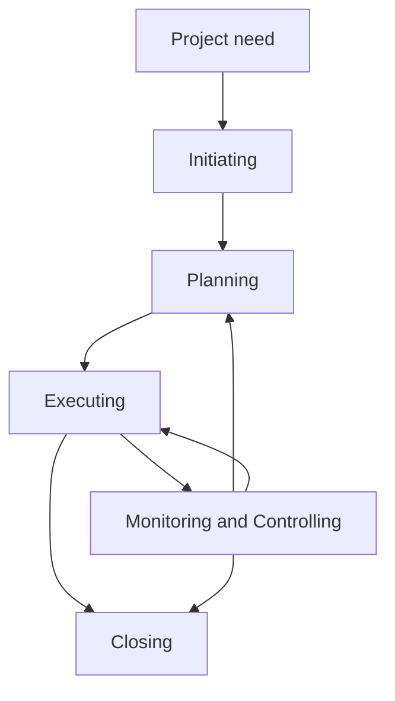

# PF1101A — Chapter 3: Project Management Processes

> [!summary] Chapter overview
> Chapter 3 explains **project processes** and the **Five Project Management Process Groups**: **Initiating, Planning, Executing, Monitoring and Controlling, and Closing**. The key idea is that these process groups are not simply a one-way sequence: their outputs feed other processes, several groups may repeat, and they may overlap throughout a project or within individual project phases.

---

## 1. The Project Processes

### What is a project process?
- Projects are composed of **processes**.
- Processes are **series of actions or activities**.
- Processes **monitor and move the phases along**.

> [!important]
> Project **phases** describe parts of the project life cycle, while project management **processes** are the activities used to manage and move work through those phases.

### The five process groups
1. **Initiating**
2. **Planning**
3. **Executing**
4. **Monitoring and Controlling**
5. **Closing**

The lecture uses the reminder:
- **“Measure Twice, but Cut Once.”**
- **“If you fail to plan, you are planning to fail.”**

### How the process groups interact
- Initiating establishes the project.
- Planning is **iterative**.
- Executing carries out the planned work.
- Monitoring and Controlling checks whether the project is going according to plan and feeds adjustments back into the work.
- Closing closes a project or phase.

![[Attachments/Five_PM_Process_Groups_Flow.png]]

> [!important] Not a simple linear sequence
> The five process groups interact. Planning, Executing, and Monitoring and Controlling can feed back into one another rather than occurring only once.

### Processes operate at different levels of project work
The lecture illustrates that the five PM processes can appear within work at many levels, from a **parent project**, to phases and projects, down through a **WBS**, stages and operations.

For the hypothetical RWS example:
- Parent project: **RWS**
- Major parts include **Hotels, Theme Park, Casino**.
- Work can be decomposed into phases, projects, stages, WBS elements and operations.
- The five PM processes can be applied even to a smaller operation such as scaffolding work, together with the relevant knowledge areas.

![[Attachments/RWS_PM_Processes_WBS.png]]

---

## 2. Five PM Process Groups

### Core characteristics
The five process groups are **Initiating, Planning, Executing, Monitoring/Controlling and Closing**.

- Process groups are a **collection of activities contributing to the PLC**.
- The **output of one process group** can become the **input for another process group**.
- Some process groups may repeat, especially:
  - Planning
  - Monitoring/Controlling
  - Executing
- Process groups may **overlap**.

![[Attachments/PM_Process_Groups_Overlap.png]]

> [!important]
> The amount of activity in each process group changes over time. The lecture diagram shows Initiating early, Planning building up before and during Execution, Monitoring and Controlling spanning much of the work, and Closing becoming important near the end.

### Processes may be iterative
Planning, Executing, and Monitoring and Controlling can repeat throughout the project. This means the project team may:
1. plan work,
2. execute it,
3. monitor the results,
4. control or adjust the work,
5. return to planning when needed.

### Process groups can occur within project phases
The five PM processes can be applied across the whole project management life cycle, or repeated within separate phases.

![[Attachments/PM_Processes_Across_Phases.png]]

In the lecture example, separate phases such as **Hotels**, **Theme Park**, and **Casino** can each contain their own Initiating, Planning, Executing, Monitoring and Controlling, and Closing activities before the overall project is completed.

### Relationship with knowledge areas
The lecture positions **Project Integration Management** around the five PM processes and shows the PM processes operating across the knowledge areas taught in the course, including:
- Scope Management
- Time Management
- Cost Management
- Quality Management
- HR Management
- Communications Management
- Risk Management
- Procurement Management

The project manager integrates these areas rather than treating them as isolated workstreams.

### Application in the GRPP utilitarian project
The lecture applies the process framework to the GRPP and notes that the same template can be used across the knowledge areas.

![[Attachments/GRPP_PM_Process_Application.png]]

Key ideas shown include:
- **Execution**: follow the process flowchart and conduct activities necessary to complete the work.
- **Monitoring and control**: conduct progress meetings, compare actual work against planned work, and report schedule variance.
- **Closing**: test deliverables, obtain certification where applicable, establish an operations plan, collect and store project records, and summarize achievements and lessons learned.
- **Managing change** runs across the work rather than being confined to one isolated point.

---

## Case Study: Uber — From Idea to Projects

### Initiating
Uber is used to illustrate how a project begins from a need and desired future state.

- **Initial need:** make ride-hailing easier and more reliable.
- **Core solution:** a smartphone app connects riders with private-hire drivers.
- **Business model:** algorithm-based fares and commission from each booking.

> [!example] PM lesson
> Initiating starts with the **need, desired future state, stakeholders and high-level scope**.

### Planning and progressive elaboration
- Uber grew from San Francisco to many markets and services.
- Scope expanded to include **UberX, UberPOOL, Uber Eats and delivery services**.
- Each expansion is a project.
- Early technology and low physical infrastructure shaped time and cost strategy.

> [!example] PM lesson
> Planning is **iterative across scope, time, cost, quality, HR, communications, risk and procurement**.

### Executing, Monitoring and Controlling
**Executing** included:
- building the platform,
- recruiting drivers,
- launching cities,
- managing operations.

Local decision-making supported rapid market entry.

**Monitoring/control** included:
- ratings,
- tracking,
- pricing data,
- complaints,
- feedback.

> [!example] PM lesson
> Execution needs **controls, feedback loops and change management**.

### Risk, stakeholders and closing lessons
- Rapid growth created **regulatory, competition, culture and public-trust risks**.
- Market decisions included **acquisitions, exits and service changes**.
- Closing can mean **exit, transition, handover, review or lessons learned**.

> [!example] PM lesson
> **IPEMC repeats across knowledge areas and the project life cycle.**

---

## Example: Painting Robot Implementation

The lecture uses a digital solution project to show the five process groups in one consistent example.

### Initiating
Start the project and define why it is needed.

- **Problem:** painting is labour-intensive, variable in quality, and schedule-sensitive.
- **Business case:** expected productivity, quality, cost and learning benefits.
- **Stakeholders:** client, contractor, painters, vendor, QA, safety and IT teams.
- **Preliminary scope:** pilot zone, success criteria, constraints and assumptions.
- **Decision:** approve a pilot, defer it, or stop the idea early.

### Planning
Convert the idea into an implementable plan.

- **WBS and schedule:** procurement, site preparation, trial, rollout and review.
- **Cost and finance:** robot rental or purchase, materials, training and support.
- **Quality plan:** finish standard, coverage, inspection method and rework limits.
- **HR and communications:** roles, training, change management and coordination.
- **Risk/procurement:** trade interfaces, downtime, adoption, safety, data and vendor support.

### Executing
Carry out the planned work with the project team.

- Procure or mobilise the robot, paint system and vendor support.
- Prepare site conditions: surfaces, power, materials, access and work zones.
- Configure the robot and run the pilot area.
- Train operators, supervisors and affected trades.
- Record issues and adjust the method statement before wider rollout.

### Monitoring / Control
Track performance and make controlled adjustments.

- **Productivity:** painted area per day compared with baseline.
- **Quality:** coating coverage, finish, defects and rework.
- **Cost and schedule variance**, including robot downtime.
- Workforce adoption and coordination with other trades.
- **Change requests:** scope, layout, sequence, resources or vendor support.

### Closing
Complete the pilot or rollout and capture learning.

- Accept completed painted areas and confirm deliverables.
- Handover SOPs, maintenance plan, training records and data.
- Compare actual benefits with the original business case.
- Document lessons learned and update future templates.
- Decide whether to **stop, repeat in the next zone, or scale to future projects**.

> [!tip] Revision idea
> Use the painting robot example to test whether you can distinguish the five process groups: **why/start → plan → do → check/control → complete/learn**.

---

## 3. The Initiating Process Group

The Initiating Process Group establishes the need and high-level direction of the project.

### Main activities
1. **Identifying needs**
2. **Feasibility study**
3. **Create a Product Description or desired future state**
4. **Create a Preliminary Scope Statement**

> [!important]
> Initiating is concerned with understanding **why the project is needed** and defining the project at a preliminary level before committing to detailed planning and execution.

---

## 4. The Planning Process Group

### Nature of planning
- Planning processes are **iterative**.
- **Include the stakeholders**.
- Obtain **buy-in of deliverables**.

Planning progressively turns the project idea into a coordinated set of plans.

### 1. Create a Scope Statement
The project scope is stated before the work is decomposed and scheduled.

### 2. Create the Work Breakdown Structure (WBS) — “The Mothership”
The WBS breaks project deliverables into progressively more detailed levels.

![[Attachments/Hotel_WBS_Decomposition.png]]

For the hotel building example:

| WBS level | Meaning in the lecture |
|---|---|
| **Level 1** | Project Title |
| **Level 2** | Project Phases/Deliverables |
| **Level 3** | Work Packages |
| **Level 4** | Tasks/Activities |

Key points:
- Each WBS level progressively provides more information.
- The WBS is **deliverable-focused**, so it should focus on the **“things” that will be produced or created**.
- Level 4 activities/tasks contribute to completing a specific Level 3 work package.
- Related Level 3 work packages contribute to a Level 2 project phase or deliverable.
- All Level 2 project phases/deliverables contribute to completion of the Level 1 project.

The bicycle example also shows how effort or cost can be allocated to individual WBS elements.

![[Attachments/Bicycle_WBS_Example.png]]

> [!important]
> The WBS is the basis for breaking a large project into manageable deliverables, work packages, and finally the activities needed to complete them.

### 3. Create the Network Diagram
A **network diagram illustrates workflow**.

![[Attachments/Network_Diagram_Workflow.png]]

### 4. Develop the Project Schedule (Time)
The networked activities are used to develop the project schedule.

### 5. Complete Cost Estimates
Estimate the costs associated with the planned project work.

### 6. Plan for Project Financials
Plan the:
- **budget**, and
- **cash flow projections**.

The lecture notes that cash flow projections enable organizations to plan for project expenses.

![[Attachments/Project_Cashflow_S_Curve.png]]

### 7–12. Other planning activities
7. **Create a Quality Management Plan**
8. **Plan for Human Resource Needs**
9. **Create a Communications Plan**
10. **Complete Risk Management Plan**
11. **Plan for Project Contracting (Procurement)**
12. **Official launch of project with collective agreement**

### Planning checklist
> [!summary] Planning outputs highlighted in the lecture
> - Scope Statement
> - WBS
> - Network Diagram
> - Project Schedule
> - Cost Estimates
> - Budget and cash flow projections
> - Quality Management Plan
> - Human Resource Needs
> - Communications Plan
> - Risk Management Plan
> - Project Contracting / Procurement planning
> - Collective agreement for official project launch

---

## 5. The Executing Process Group

Executing means carrying out the planned project work.

### Main activities
- **Direct and manage project execution** — carry out the work.
- **Develop the project team** — HRM.
- **Disseminate project information** — Communications.
- **Manage procurement activities**.
- **Manage risk activities**.
- **Map to quality assurance**.

> [!important]
> Executing is not only physical production. It also includes managing the team, information, procurement, risks and quality assurance while the work is being performed.

---

## 6. The Monitoring & Controlling Process Group

Monitoring and Controlling contains:
- activities to ensure the project goes **according to plan**, and
- actions taken when the project is **not going as planned**.

### Monitor & Control (I)
- Manage Integrated Change Control
- Provide Scope Verification
- Implement Scope Change Control
- Enforce Schedule Control

### Monitor & Control (II)
- Manage Cost Control
- Ensure Quality Control
- Manage Project Team
- Ensure & Complete Performance Reporting
- Manage Project Stakeholders
- Monitor & Control Project Risks

> [!important]
> Monitoring and Controlling compares actual performance with the plan and supports controlled corrective changes when deviations occur.

### Quality control
The lecture illustrates quality control by comparing **planned** and **experienced** quality over the schedule. The topic is indicated as being elaborated in more detail later in the course.

---

## 7. The Closing Process Group

Closing formally completes project or phase activities.

### Main activities
- **Audit Procurement Documents**
- **Close Vendor Contracts**
- **Close Administrative Duties**
- **Celebrations**

The earlier case examples also connect closing with:
- acceptance of deliverables,
- handover,
- review,
- project records,
- lessons learned,
- transition or exit.

---

## Chapter 3 — Key Connections

> [!important]
> The arrows back to Planning and Executing reflect the lecture's emphasis that project management processes can be **iterative and overlapping**.

## Exam / Revision Checklist

- [ ] Can I define a project process as a series of actions or activities?
- [ ] Can I name the five PM process groups in order?
- [ ] Can I explain why the five groups are **not** simply a one-way sequence?
- [ ] Can I explain how outputs from one process group become inputs to another?
- [ ] Can I distinguish project **phases** from PM **process groups**?
- [ ] Can I list the four main Initiating activities?
- [ ] Can I explain why Planning is iterative and why stakeholders should be included?
- [ ] Can I explain the WBS levels from project → phases/deliverables → work packages → tasks/activities?
- [ ] Can I list the major Planning activities from Scope Statement through official launch?
- [ ] Can I identify the activities that belong to Executing?
- [ ] Can I identify the controls used in Monitoring and Controlling?
- [ ] Can I list the main Closing activities?
- [ ] Can I classify each part of the painting robot example into Initiating, Planning, Executing, Monitoring/Control or Closing?
- [ ] Can I explain how the five PM processes can repeat within separate project phases?

> [!summary] Chapter core
> **Initiating** defines why and what at a preliminary level.  
> **Planning** converts the project into coordinated, implementable plans.  
> **Executing** carries out the planned work.  
> **Monitoring and Controlling** checks performance and makes controlled adjustments.  
> **Closing** completes the project or phase and captures the required closure and learning.  
> Across the project, these processes can **overlap, repeat and interact**.
