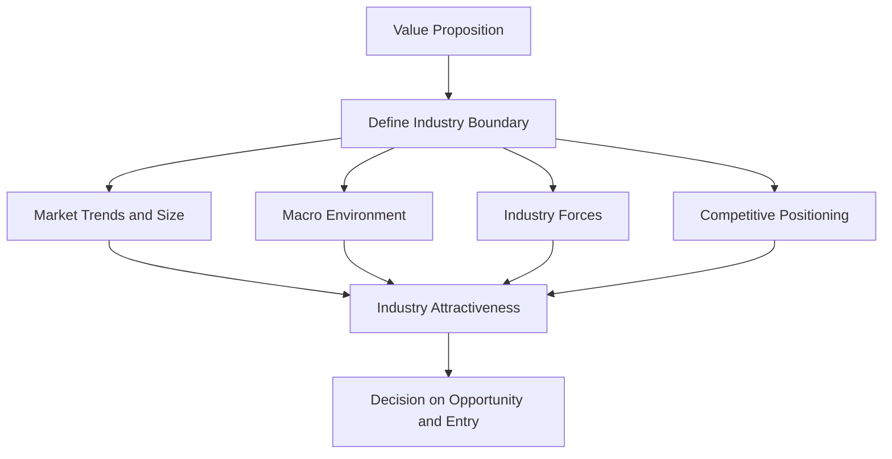

# CDE2301 — Week 4: Understanding Industry Structures and Competitive Strategies

> [!summary] Chapter overview
> Week 4 develops a way to choose between the many possible business opportunities enabled by innovation. The lecture connects the **Value Proposition** to **Industry Attractiveness**, then examines how to define an industry boundary, estimate market size, study the macro environment, analyze industry forces, and position an offering against competitors. The central question is: **What industry has the best opportunity gap to apply your core technologies to solve an entrenched problem?**

---

## 1. From Value Proposition to Business Choices

### Pain relievers and gain creators

The lecture distinguishes the two parts of a Value Proposition Canvas using customer response:

- **Pains cause complaints.**
- **Gains cause recommendations.**
- **Relieving pain gets you considered.**
- **Creating gains gets you chosen.**

The distinction is therefore based on what the customer is trying to avoid versus what makes the offer especially desirable.

### VPC case study: food stall

The food-stall example links a customer profile to a campus food-store pre-order service.

**Customer jobs** include:
- Eat between class.
- Get to the next lecture on time.
- Stay within daily budget.

**Customer pains** include:
- Long queues.
- Queues visible only on arrival.
- Best dishes selling out very quickly.

**Customer gains** include:
- Enjoying a meal with your group.
- Less waiting time.

The proposed service responds with features such as:
- Live waiting time.
- Portions held for pre-orders.
- Group order, one table.
- Collection in less than 5 minutes.

![[Attachments/VPC Food Stall.png]]

> [!important]
> A Value Proposition is not isolated from later business decisions. It frames what the business offers, who it serves, the benefits it creates, and the internal choices required to deliver those benefits.

---

## 2. Value Proposition Frames Critical Choices

Innovation can enable **multiple choices in Value Propositions**, which creates a major challenge in effective business building: **too many choices**.

The Value Proposition helps frame two groups of critical choices.

### Positioning choices

- What business are you in?
- What products are you offering?
- Who are you propositioning?
- What benefits are you offering?

### Internal choices

- Processes, Shared Services, and Infrastructures.
- People and Partners.
- Organization and Culture.
- Customer Engagement Process.

These choices influence the business model that follows from the selected Value Proposition.

---

## 3. TRIA Case Study — Choosing an Opportunity

The TRIA case illustrates how the same core technology can lead to very different Value Propositions.

### Two possible opportunities

**Option A — Process food waste as a service**
- Opportunity context: **2,000 tonnes of food waste/day**.

**Option B — Sell the fertilizer**
- Opportunity context: **USD 193B market size in 2021**.

The lecture emphasizes that these are **two very different Value Propositions** even though they can originate from the same technology.

![[Attachments/TRIA Opportunity Options.png]]

### Option A: process waste

Questions framing this option include:

1. What kinds of waste?
2. Who cares?
3. Who pays?
4. Who else is doing this?

The lecture describes this path as **New Capability Innovation**:

- Utilize or sell the technology as a product/service for waste processing.
- GTM pathway: **Customization → Systems Integration → Solutions Selling**.
- Pursuing this path frames business model choices.

### Option B: produce fertilizers

Questions framing this option include:

1. What is the input source?
2. Is the output good?
3. What is the market size?
4. What is the go-to-market approach?

The focus shifts toward **Competitive Advantage**, with several possible business arrangements:

- Build wholly owned factories / joint-venture factories.
- License technology to abattoirs/farms.
- Work with existing fertilizer providers.
- Produce an own-branded organic fertilizer.

The lecture notes that this could produce:

- a **complex business model**, and
- possibly a **higher revenue opportunity than Option A**.

### Making the choice

The guiding question is:

> **What industry has the BEST OPPORTUNITY GAP to apply your core technologies to solve an entrenched problem?**

This leads directly into the analysis of **Industry Attractiveness**.

---

## 4. Industry Attractiveness

> [!definition]
> **Industry attractiveness** indicates how hard or easy it will be for a company to compete in the market and earn profits.

The lecture organizes Industry Attractiveness around four areas:

- **Market Size & Growth Conditions**
- **Industry Forces**
- **Macro Environment**
- **Competitive Positioning**

![[Attachments/Industry Attractiveness Framework.png]]

A broader list of tools and considerations presented in the lecture includes:

- Industry & Market Size.
- Industry Average Profit vs Invested Capital (ROIC).
- Supply & Value Chain Analysis.
- Porter's Five Forces.
- SWOT Analysis.
- Long Term Growth Trend (Industry Cycle).
- Macro Environment (PESTLE Analysis).
- Competitive Positioning.
- Market Segmentation.

---

## 5. Industry Boundary

Before analyzing an industry, its boundary needs to be defined explicitly.

### Four dimensions of an industry boundary

Industry boundaries can be defined along four dimensions:

| Dimension | Meaning in the lecture |
|---|---|
| **What?** | Product/services |
| **Who?** | Customer groups |
| **Where?** | Geography |
| **How?** | Technology, Business Models |

### Industry boundary vocabulary

An explicit industry definition clarifies the different possible roles around the industry:

- **Industry/Rivals** — competing inside the industry.
- **Potential Entrants** — outside the industry, but may enter.
- **Substitutes** — outside the industry, but erode demand.
- **Complementors** — outside the industry, but increase demand.
- **Suppliers** — sell products/services to firms inside the industry.
- **Buyers** — distribute/buy products/services from firms inside the industry.

> [!important]
> The industry boundary affects who is treated as a rival, entrant, substitute, complementor, supplier, or buyer. Define the boundary before applying the later industry-analysis frameworks.

---

## 6. Industry & Market Size

The lecture divides the market into progressively narrower levels:

1. **Total Available Market (TAM)**
2. **Serviceable Available Market (SAM)**
3. **Target Market**
4. **Market Share**

![[Attachments/TAM SAM Target Market.png]]

### Total Available Market (TAM)

> [!definition]
> **TAM** refers to the **global revenue opportunity available for a product or service**.

To estimate TAM:

- Estimate the Total Available Market size.
- Use credible sources such as:
  - government data,
  - trade associations,
  - financial data from major players,
  - customer surveys.
- These sources should support a rough estimation.
- If credible information is unavailable, size the market using a **top-down** or **bottom-up** approach.

### Top-down and bottom-up market sizing

The lecture uses the example of sizing the **Medical Consumers Market in Singapore GPs**, such as gloves, syringes, and swabs.

#### Top-down approach

The example combines:

1. Total SG Population.
2. No. of GP Visits Per Year, By Age Band.
3. Average Consumption Per GP Visit ($).
4. Total Market Size ($).

#### Bottom-up approach

The example combines:

1. No. of GPs in SG.
2. Average Consultations Per GP in SG Per Day.
3. Average Consumption Per GP Consultation ($).
4. Total Market Size ($).

![[Attachments/Market Sizing Top Down Bottom Up.png]]

> [!important]
> Top-down and bottom-up are presented as alternative ways of producing a rough market-size estimate when direct credible market-size information is unavailable.

### Serviceable Available Market (SAM)

> [!definition]
> **SAM** refers to the **percentage of the Total Available Market (TAM) that you can serve**.

Estimate the SAM size after establishing TAM.

### Target Market

> [!definition]
> The **Target Market** refers to the **group of customers that you want to market your products to**.

Estimate the Target Market size based on the estimated TAM and SAM.

### Market Share

> [!definition]
> **Market Share** refers to a **percentage of your target market**.

Estimate market share:

- in percentage, and
- in dollars,

based on the **unique selling proposition** and **marketing plan**.

---

## 7. Macro Environment — PESTLE Analysis

The lecture introduces **PESTLE Analysis** as the framework for examining the macro environment.

PESTLE considers six areas:

- **P — Political**
- **E — Economical**
- **S — Social**
- **T — Technological**
- **L — Legal**
- **E — Environmental**

![[Attachments/PESTLE Analysis.png]]

The purpose within the Week 4 framework is to consider the **Macro Environment** as one contributor to overall Industry Attractiveness.

---

## 8. Industry Forces — Porter's Five Forces

> [!definition]
> **Porter's Five Forces** determine the **competitive structure of an industry and its profitability**.

The five forces are:

1. **Threat of New Entrants**
2. **Bargaining Power of Buyers**
3. **Bargaining Power of Suppliers**
4. **Threat of Substitutes**
5. **Competitive Rivalry**

![[Attachments/Porters Five Forces Framework.png]]

### Why the Five Forces matter

The lecture states that:

- Every industry is different, but the underlying drivers of profit are the same.
- Industry structure and a company's relative position are the primary drivers of company profitability.
- Analyzing the Five Forces can help companies:
  - anticipate shifts in competition,
  - shape how industry structure evolves,
  - find better strategic positions.
- Porter's Five Forces can be applied to any industry and company size.

### Questions Porter's Five Forces can answer

- What forces beyond direct competitors shape your industry?
- What makes your industry profitable?
- Where can you find a position amongst your competitors that is profitable and difficult to attack?

Based on the framework, companies should:

- position themselves where forces are weakest,
- exploit changes in the forces,
- design those forces to their advantage.

### Factors affecting each force

![[Attachments/Porters Five Forces Factors.png]]

#### Threat of New Entrants

- Barriers to Entry.
- Economies of Scale.
- Capital Requirements.
- Product Differentiation / Brand Equity.

#### Threat of Substitutes

- Buyer Potential to Substitute.
- Number of Substitute Products / Services.
- Performance of Substitutes.
- Cost of Change.

#### Bargaining Power of Suppliers

- Suppliers Concentration / Number of Suppliers.
- Uniqueness of Products / Services.
- Ability to Substitute.
- Supplier Switching Costs.

#### Bargaining Power of Buyers

- Buyer Concentration / Number of Customers.
- Buyer Switching Costs.
- Price Sensitivity.
- Differential Advantage.

#### Competitive Rivalry

- Number of Competitors / Firm Concentration Ratio.
- Customer Loyalty.
- Requirements for Advertising Expenses.
- Quality Differences / Competitive Advantage through Innovation.

### Five Forces analysis procedure

The lecture gives the following action steps:

1. Go through each force using a checklist and assess attractiveness.
2. Make an overall assessment, noting which of the forces are important.
3. Decide whether to enter the industry — and why.
4. If entering the industry, choose between:
   - **Low-Cost**, or
   - **Differentiation**.

> [!important]
> The Five Forces analysis is not only a description of competitors. It is used to assess the industry's attractiveness, identify the important forces, support the decision of whether to enter, and guide the strategic choice between Low-Cost and Differentiation.

---

## 9. Supply & Value Chain Analysis

The airline-industry example shows that an industry contains multiple linked participants rather than only the focal firms and customers.

![[Attachments/Airline Industry Supply Chain.png]]

The example places **Airlines** at the center, including:

- network carriers,
- low cost carriers,
- charter airlines.

Other participants include:

### Equipment Provider
- Aircraft & Engines.
- Lessors.

### Infrastructure Service Provider
- Maintenance.
- Catering.
- Handling.
- Airports.

### Channels
- GDS.
- Travel agencies (offline & online).
- Tour operators.
- Consolidators.

These ultimately connect to **Customers/Passengers** and **Customers/End User/Beneficiaries**.

This supply-chain view supports the broader analysis of industry structure by showing the participants surrounding the focal industry.

---

## 10. Competitive Analysis

The lecture presents a three-part competitive-analysis structure.

| Competitor | Competitor's Unique Value Proposition | Response |
|---|---|---|
| Who is already addressing your market (**existing competitor**), and who is about to arrive (**new entrants**)? | What is the value proposition for the competitor's products? | How will you compete with this competitor and why? — **ignore, monitor, action** |

A useful competitive analysis therefore requires more than naming competitors. It connects each competitor to its Value Proposition and then determines an appropriate response.

---

## 11. Competitive Positioning — Competition Perceptual Diagram

> [!definition]
> A **Perceptual diagram** visually represents how your proposed product is positioned against competing offers on the **key dimensions of performance**.

![[Attachments/Competition Perceptual Diagram.png]]

### Selecting the factors

The lecture gives three important guidelines:

1. **Factors 1 & 2 should be related to your JTBD & key performance factors.**
2. Identify **2 factors that are difficult for companies to excel in both simultaneously**, creating an opening for you to enter.
3. A **3rd factor** can sometimes be represented by the **size of the bubble**. This is generally an additional factor rather than the critical differentiator.

### Coffee example

The coffee perceptual diagram positions competing offers using:

- **Convenience (anytime, fast)**, and
- **Fresh Roasted Taste**.

The competing offers shown include:

- Instant Coffee.
- Coffee Capsules.
- Coffee Shops.
- French Press.
- Cafés.

A question mark indicates a possible open position in the market.

The lecture also notes that a third factor such as **price per cup of coffee** could be represented by icon size, for example:

- larger icon = more expensive.

![[Attachments/Coffee Perceptual Diagram.png]]

> [!important]
> The perceptual diagram is intended to reveal a possible competitive opening. The two main dimensions should therefore come from the JTBD and key performance factors, and should represent dimensions on which it is difficult to excel simultaneously.

---

## 12. Connecting Value Proposition and Industry Attractiveness

The Week 4 material extends the earlier Value Proposition work into an analysis of whether the selected opportunity is attractive to pursue.

The lecture's mid-point framework combines:

### Value Proposition

- Jobs-to-Be-Done.
- Technology Step Changes.
- CRT & FRT.
- Value Proposition Canvas & Statement.
- Stakeholder Map.

### Industry Attractiveness

- Market Trends & Size.
- Macro Environment Analysis (**PESTLE Analysis**).
- Industry Forces (**Porter's 5 Forces**).
- Supply & Value Chain Analysis.
- Competitive Analysis & Positioning.

The Week 4 analysis can therefore be viewed as a sequence:

---

## Chapter Summary / Key Connections

- Innovation can create **many possible Value Propositions**, making business choices difficult.
- The Value Proposition frames both **positioning choices** and **internal choices**.
- The key opportunity question is which industry has the **best opportunity gap** for applying the core technology to an entrenched problem.
- Before analyzing an industry, define its boundary using **What, Who, Where, and How**.
- **Industry Attractiveness** indicates how hard or easy it will be to compete and earn profits.
- The Week 4 framework focuses on **Market Size & Growth Conditions, Industry Forces, Macro Environment, and Competitive Positioning**.
- Market sizing progresses from **TAM → SAM → Target Market → Market Share**.
- When direct credible market information is unavailable, market size can be estimated through **top-down** or **bottom-up** approaches.
- **PESTLE Analysis** examines the macro environment.
- **Porter's Five Forces** examines the competitive structure of the industry and its profitability.
- Supply and value chain analysis identifies the wider set of participants surrounding the focal industry.
- Competitive analysis considers the **competitor, competitor's unique Value Proposition, and response**.
- A **Competition Perceptual Diagram** compares offers on two key performance dimensions to identify a possible opening for entry.
- After assessing the Five Forces, the lecture frames entry strategy as a choice between **Low-Cost** and **Differentiation**.

---

## Exam / Revision Checklist

- [ ] Can I explain the lecture's distinction between **pain relievers** and **gain creators**?
- [ ] Can I explain how a Value Proposition frames **positioning** and **internal choices**?
- [ ] Can I explain why the same core technology can create different Value Propositions using the TRIA example?
- [ ] Can I define an industry boundary using **What, Who, Where, and How**?
- [ ] Can I distinguish **rivals, potential entrants, substitutes, complementors, suppliers, and buyers**?
- [ ] Can I explain what **Industry Attractiveness** means?
- [ ] Can I distinguish **TAM, SAM, Target Market, and Market Share**?
- [ ] Can I describe the **top-down** and **bottom-up** market-sizing approaches shown in the lecture?
- [ ] Can I identify the six parts of **PESTLE Analysis**?
- [ ] Can I identify and explain the five parts of **Porter's Five Forces**?
- [ ] Can I use the lecture's checklist factors to assess each of the Five Forces?
- [ ] Can I follow the lecture's action steps from Five Forces assessment to the entry decision?
- [ ] Can I identify the main participants in a **Supply & Value Chain Analysis**?
- [ ] Can I structure a **Competitive Analysis** using competitor, unique Value Proposition, and response?
- [ ] Can I construct and interpret a **Competition Perceptual Diagram** using two JTBD/key-performance factors?
- [ ] Can I explain how Week 4's frameworks combine to assess **Industry Attractiveness**?

---

## Key Concepts / Frameworks

> [!summary]
> **Industry Boundary**  
> What? — Product/services  
> Who? — Customer groups  
> Where? — Geography  
> How? — Technology, Business Models
>
> **Industry Attractiveness**  
> Market Size & Growth Conditions  
> Industry Forces  
> Macro Environment  
> Competitive Positioning
>
> **Market Size**  
> TAM → SAM → Target Market → Market Share
>
> **PESTLE**  
> Political → Economical → Social → Technological → Legal → Environmental
>
> **Porter's Five Forces**  
> Threat of New Entrants  
> Bargaining Power of Buyers  
> Bargaining Power of Suppliers  
> Threat of Substitutes  
> Competitive Rivalry
>
> **Competitive Analysis**  
> Competitor → Competitor's Unique Value Proposition → Response
>
> **Competitive Strategy after entry decision**  
> Low-Cost OR Differentiation

---

> [!warning] Source-coverage note
> The lecture slides were fully reviewed for this note. The supplied lecture recording (`Voice 260903_190305.m4a`, approximately 99 minutes 44 seconds) was available as an audio file, but this environment did not provide a speech-transcription capability that could reliably process its spoken content. Therefore, this version **does not claim full lecture-audio coverage**. In accordance with the Master Prompt, no unsupported verbal explanations were inferred or added from outside knowledge.
