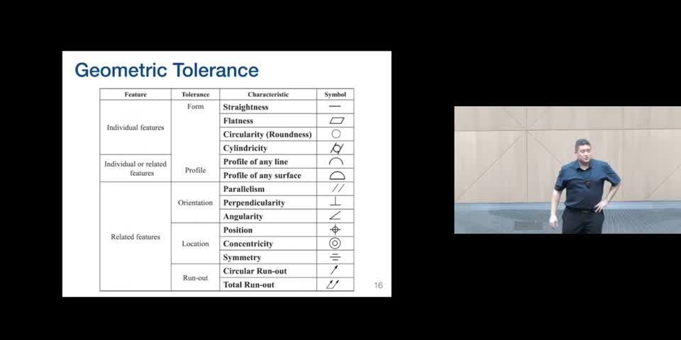
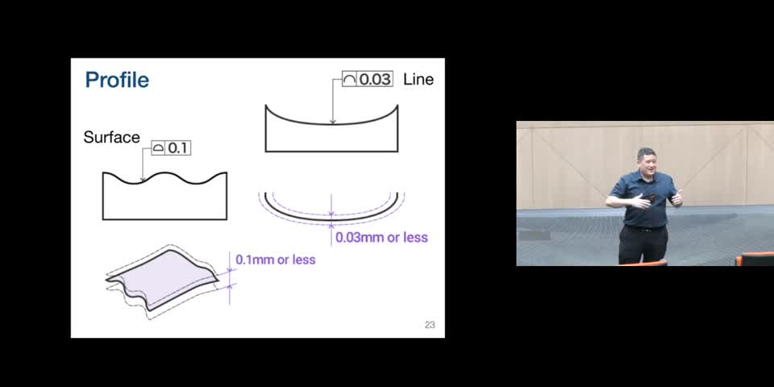
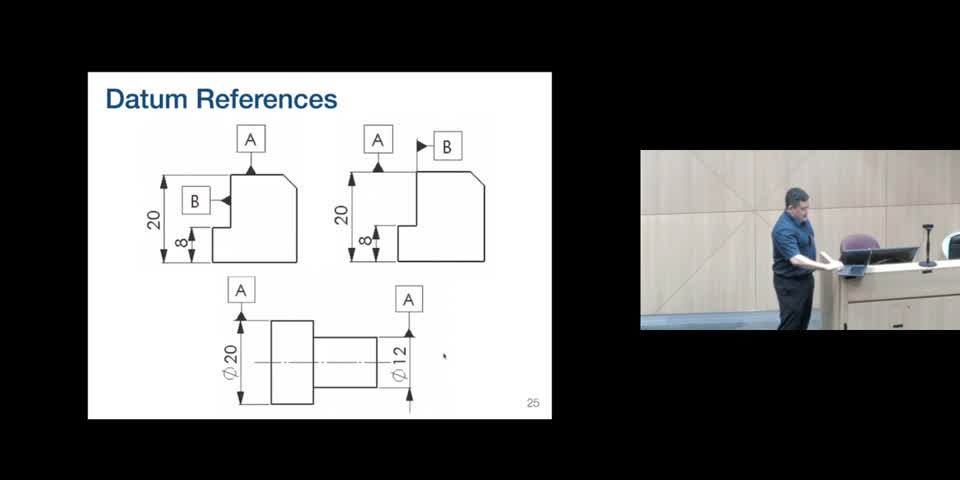
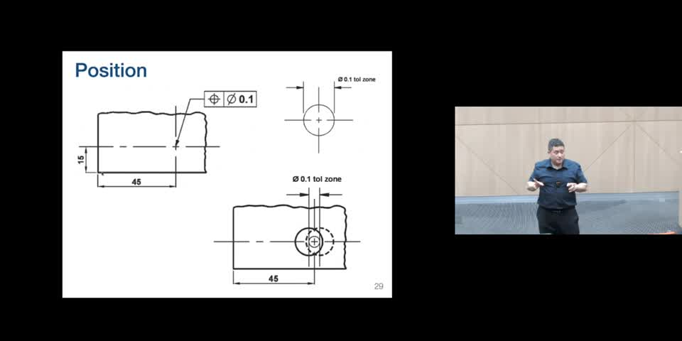
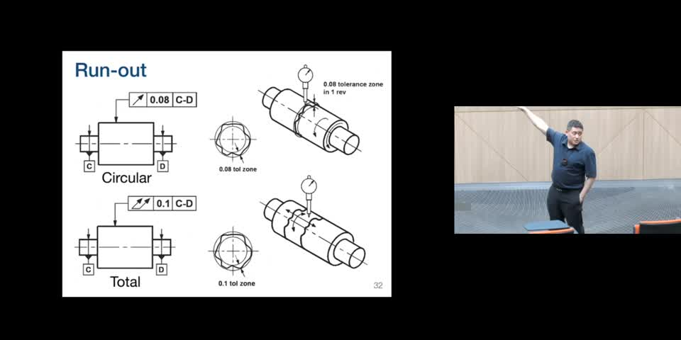
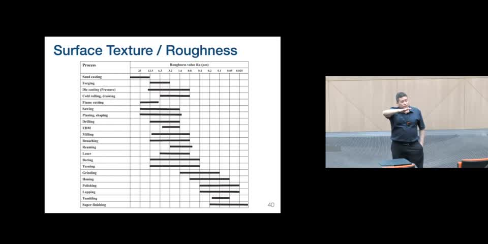

# ME 202 — Lecture 7: Geometric Tolerancing & Surface Roughness

**Lecture length:** ~46 min 39 s  
**Main topic:** Why ordinary dimensional/limit tolerances are not enough, and how geometric tolerancing communicates acceptable **form, orientation, location, and runout** of manufactured features.

---

## 1. Why geometric tolerancing is needed

### Recap: limit tolerances
The previous lecture dealt with **limit tolerances**: allowable numerical ranges for linear/angular dimensions, including hole–shaft fits, international tolerance grades, fundamental deviations, and standard fits.

Limit tolerances answer questions such as:
- How large or small may a dimension be?
- Will a shaft fit inside a hole?
- What dimensional variation is acceptable for manufacture/assembly?

### The limitation
A part can satisfy every stated dimensional limit and still have the **wrong shape**.

An engineering drawing often implicitly assumes that:
- a drawn straight line represents a truly straight feature;
- a planar face is actually flat;
- two apparently perpendicular faces really are perpendicular;
- a cylindrical feature behaves like a cylinder rather than a cone, bent tube, or warped surface.

But these assumptions are **not fully communicated by dimensional tolerances alone**. A real manufactured surface contains many points, and its geometry can vary even while selected measurements remain within their dimensional limits.

**Key distinction:**
> **Limit tolerances constrain dimensions; geometric tolerances constrain the geometry/form and relationships of features.**

Geometric tolerancing therefore supplements rather than replaces dimensional tolerancing.

---

## 2. Reading a geometric tolerance callout

A geometric tolerance is commonly written in a **feature control frame** (a row of boxes). In the lecture's examples, the frame contains:

1. **Geometric characteristic symbol** — identifies what is being controlled (flatness, perpendicularity, position, etc.).
2. **Tolerance value** — the size of the permitted tolerance zone.
3. **Datum reference(s), when required** — identifies the reference plane/axis to which the controlled feature is related.

For example, a surface may first be declared **flat** and identified as **datum A**; another feature can then be required to be **perpendicular to datum A**.

*Screenshot (~12:00): overview of the geometric tolerance characteristics and their symbols.*

---

## 3. Intrinsic vs. extrinsic geometric tolerances

A useful organizing idea from the lecture is the difference between **intrinsic** and **extrinsic** controls.

### Intrinsic controls
These describe a feature **by itself**, without needing another feature as a reference. They answer questions such as “Is this surface flat?” rather than “Is it flat relative to something else?”

Important intrinsic controls covered:
- Straightness
- Flatness
- Circularity (roundness)
- Cylindricity
- Profile of a line / profile of a surface when used intrinsically

### Extrinsic controls
These describe a feature **relative to a datum/reference**. Examples include:
- Parallelism
- Perpendicularity
- Angularity
- Position
- Concentricity
- Symmetry
- Circular runout
- Total runout
- Profile controls when referenced to a datum

**Exam-oriented takeaway from the lecture:** know the symbols, whether the control is intrinsic/extrinsic, and broadly what geometry each control constrains. The lecturer explicitly says students are **not expected to apply full GD&T schemes to their own drawings** in this course.

---

# 4. Form tolerances

## 4.1 Straightness

**Purpose:** constrains a line element so that it does not bend excessively.

For a surface straightness control, imagine tracing lines along the specified direction. Each sampled line must remain within a narrow tolerance band. The lecture uses the idea of two parallel boundary lines separated by the specified tolerance (for example, 0.01 mm).

Important points:
- Straightness in one direction **does not imply flatness** of the whole surface.
- A surface could be straight along one direction while waviness exists in the perpendicular direction.
- On a cylindrical feature, axial lines can satisfy straightness even if the cross-section is not perfectly circular.

### Measurement concept: dial gauge
A machinist can sweep a **dial gauge/dial indicator** across a feature and observe vertical displacement. The maximum-to-minimum variation gives practical evidence of whether the feature remains inside the allowed zone.

Because it is impossible to inspect infinitely many lines/points, manufacturing inspection normally **samples** representative paths or cross-sections.

---

## 4.2 Flatness

**Purpose:** controls an entire surface rather than a single line direction.

Imagine two **parallel planes** separated by the specified flatness tolerance. Every point of the actual surface must lie between those planes.

Important distinction:
- Flatness is **intrinsic**.
- The two bounding planes can orient themselves to best contain the surface; they do not have to align with another feature.
- Therefore, a surface can be very flat but still be tilted relative to another surface.

---

## 4.3 Circularity (roundness)

**Purpose:** controls individual circular cross-sections of a rotational feature.

For each cross-sectional slice, the actual surface must fit between **two concentric circles** whose radial separation equals the circularity tolerance.

Important consequences:
- Different slices do **not** have to have the same diameter.
- Their centers do not necessarily have to line up.
- A cone or vase-like shape can still satisfy circularity if each individual slice is sufficiently round.

Thus, circularity is essentially a **slice-by-slice** control.

---

## 4.4 Cylindricity

**Purpose:** controls the complete three-dimensional cylindrical surface.

The entire actual surface must fit between **two coaxial cylinders** separated by the stated tolerance.

Compared with circularity:
- Circularity constrains individual cross-sections.
- Cylindricity constrains **all surface points together**.

Cylindricity is intrinsic: it does not require an external datum.

---

# 5. Profile tolerances

Profile controls generalize the ideas above to **arbitrary curves and surfaces**, not merely lines, circles, planes, or cylinders.

*Screenshot (~22:00): profile tolerances applied to an arbitrary line and surface.*

## 5.1 Profile of a line
Controls a **one-dimensional curve**. The manufactured curve must remain within a tolerance band surrounding the ideal/theoretical profile.

A useful mental model is to “thicken” the ideal curve by the tolerance amount and require the measured profile to remain within that zone.

## 5.2 Profile of a surface
The two-dimensional equivalent: an entire manufactured surface must remain within a tolerance region surrounding the ideal surface.

## 5.3 Intrinsic and extrinsic uses
Profile is unusual because it can be used in both ways:

- **Intrinsic:** match a prescribed ideal curve/surface.
- **Extrinsic:** match or follow another datum feature.

Lecture example: suppose the bottom of a board is allowed to be slightly wavy but is established as a datum. A profile tolerance can require the top surface to **follow the same shape** closely, even though neither surface is perfectly flat.

---

# 6. Datum references

A **datum** is a reference used to define extrinsic geometric relationships.

In this lecture, the key datum types are:
- **planes** associated with nominally planar surfaces;
- **axes** associated with cylindrical features.

A datum is identified using a boxed letter such as **A**, **B**, or **C**, attached by a small flag/leader.

*Screenshot (~27:00): examples of datum references on planar and cylindrical features.*

### Important interpretation
When a datum symbol is associated with a cylinder, the reference is generally its **idealized/derived axis**, not simply the outside cylindrical skin.

The lecturer gives the intuitive example of holding a shaft in a lathe: the axis about which it effectively spins can serve as the relevant reference axis.

---

# 7. Orientation tolerances

## 7.1 Parallelism

Parallelism can be thought of as **flatness plus a required orientation**.

The controlled surface must lie between two parallel planes separated by the tolerance value, and those planes must also be **parallel to the specified datum**.

Therefore:
- a surface may be flat but fail parallelism;
- parallelism is a stronger relational requirement because it requires a datum.

## 7.2 Perpendicularity

Similar to parallelism, except the bounding tolerance zone is oriented **90° to the datum**.

The actual surface itself does not have to be mathematically perfect; it only needs to remain within the allowed pair of perpendicular bounding planes.

## 7.3 Angularity

Angularity generalizes parallelism and perpendicularity to an **arbitrary specified angle**.

For example, a surface might be required to remain between two planes oriented at **30° relative to a datum**.

Conceptually:
- parallelism ≈ angularity at 0°;
- perpendicularity ≈ angularity at 90°.

---

# 8. Position tolerance

Position controls **where the axis/center of a feature may be located** relative to its theoretically exact position.

*Screenshot (~32:00): position tolerance for a hole, using a circular/cylindrical tolerance zone.*

### Lecture example
A hole has a nominal center located 45 mm from one reference and 15 mm from another. Instead of placing independent ± tolerances on the two coordinates, position tolerance can require the hole's derived axis to lie within a **cylindrical tolerance zone** around the ideal axis.

### Why this is useful
Independent ± tolerances in X and Y create a **rectangular allowable region**. A position tolerance can instead create a **radially symmetric/circular region**, which often represents the functional requirement more naturally.

The lecturer emphasizes that the center axis is conceptual—it is a derived feature rather than a physical line that can be directly touched.

---

# 9. Symmetry

Symmetry controls whether a feature's **derived median plane** is appropriately aligned with a datum median plane.

The lecture describes a datum defined by the average/center plane between two opposing surfaces. Another pair of surfaces can then be constrained so that its own derived center plane remains inside a tolerance zone around that datum plane.

This is another control that is conceptually clear but can be difficult to measure directly because the median plane is a **derived geometric entity**.

---

# 10. Concentricity

Concentricity constrains the **derived axes/centers of cylindrical features**, not the detailed shape of their outside surfaces.

If one cylindrical feature establishes a datum axis, the center/axis of another feature must remain within the stated cylindrical tolerance zone around that reference axis.

**Do not confuse:**
- **Cylindricity** → controls the form of a cylindrical surface and is intrinsic.
- **Concentricity** → controls alignment of derived centers/axes relative to a datum and is extrinsic.

---

# 11. Runout

Runout is especially useful for rotational parts because it can be checked practically while the component rotates relative to a datum axis.

*Screenshot (~37:00): circular runout vs. total runout, illustrated using a dial indicator.*

## 11.1 Circular runout
Controls variation at an **individual circular cross-section** as the part makes one revolution about the datum axis.

A dial indicator can contact the surface while the part rotates. The change in indicator reading shows how much the surface “runs out” relative to the reference axis.

## 11.2 Total runout
Controls the **entire surface** over the length of the rotational feature, rather than just one cross-sectional circle.

A useful analogy from the lecture:
- circular runout relates to circularity in scope;
- total runout relates to cylindricity in scope;
- unlike circularity/cylindricity, runout is **referenced to an external datum axis**.

This datum relationship is crucial: a surface can be individually round yet still wobble relative to the axis about which the part must function.

---

# 12. Surface texture and roughness

Geometric tolerances mainly deal with allowable geometric deviation at the feature level. **Surface roughness** addresses variation occurring over smaller spatial scales—the fine peaks and valleys left by manufacturing processes.

A surface can contain:
- fine, high-frequency roughness;
- broader waviness/low-frequency variation;
- larger-scale form errors.

The lecture introduces roughness as a way of characterizing the small-scale profile statistically rather than only considering a maximum envelope.

## 12.1 Measuring roughness: cutoff length and center line

A measuring instrument is moved over the surface for a specified **cutoff/evaluation length, L**. This produces a profile containing peaks and valleys.

A mean/center line is established, and the deviations of the measured profile from that line are averaged in magnitude over the evaluation length.

The lecture describes the roughness value **Ra** conceptually as:

\[
R_a \approx \frac{1}{L}\int_0^L |y(x)|\,dx
\]

where `y(x)` is the profile's deviation from its mean line.

Thus **Ra has units of length** and represents an average magnitude of surface deviation.

---

## 12.2 Manufacturing process vs. achievable roughness

*Screenshot (~42:00): typical surface roughness ranges associated with manufacturing processes.*

General trend emphasized in the lecture:
- **Sand casting and forging** tend to produce comparatively rough surfaces.
- Precision finishing operations such as **grinding, honing, polishing, lapping, tumbling, and super-finishing** can produce much finer surfaces.

The chart is meant to show typical achievable ranges; the lecturer says students do **not need to memorize the chart** and that a chart would be provided if needed for a question.

---

# 13. Surface finish notation on engineering drawings

Surface texture is indicated using a dedicated surface-finish symbol/leader. Important annotations discussed include:

- **Roughness value** — the principal required surface roughness.
- **Cutoff length** — the length over which the profile should be evaluated.
- **Manufacturing/machining process** — may specify that a certain process (e.g. milling) must achieve the finish.
- **Lay/tool orientation** — may specify the direction of the surface pattern.
- **Machining allowance** — extra stock intentionally left so later machining can remove material and achieve the required surface.
- **Minimum/maximum roughness limits** — can be used to bound acceptable finish.

### Material removal symbol
A **circle added to the surface texture symbol** means that **material removal is not permitted** as a finishing/post-processing operation; the required surface should be achieved by the initial forming process.

The lecturer also notes the conventional orientation: the leader/flag is normally drawn pointing to the **right**.

---

# 14. End-of-lecture concept checks

The interactive questions reinforce three important exam points:

### Q1. Which symbol denotes total runout?
Students were expected to distinguish:
- total runout;
- circular runout;
- profile of a line;
- profile of a surface.

### Q2. Which listed geometric tolerance does **not** require a datum?
**Answer: Cylindricity.**

Why:
- Cylindricity is intrinsic.
- Concentricity requires a reference axis.
- Circular runout requires a reference axis.
- Perpendicularity requires a datum surface/plane.

### Q3. Which surface texture symbol means material should **not** be removed?
**Answer:** the surface-finish symbol containing a **circle**, in the standard right-facing orientation.

---

# 15. High-yield comparison table

| Control | Main question answered | Tolerance-zone idea | Datum required? |
|---|---|---|---|
| **Straightness** | Is a line element straight enough? | Between parallel lines / equivalent line-element zone | No |
| **Flatness** | Is the whole surface flat enough? | Between two parallel planes | No |
| **Circularity** | Is each cross-section round enough? | Between two concentric circles | No |
| **Cylindricity** | Is the whole cylindrical surface cylindrical enough? | Between two coaxial cylinders | No |
| **Profile of a line** | Does a curve follow its intended profile? | Band around ideal curve | Sometimes |
| **Profile of a surface** | Does a surface follow its intended profile? | 3D zone around ideal surface | Sometimes |
| **Parallelism** | Is the feature parallel to a reference? | Flatness-like zone aligned parallel to datum | Yes |
| **Perpendicularity** | Is it 90° to a reference? | Flatness-like zone at 90° to datum | Yes |
| **Angularity** | Is it at the specified angle? | Zone at specified angle to datum | Yes |
| **Position** | Is a feature's center/axis in the right place? | Often circular/cylindrical zone around true position | Yes / reference framework |
| **Symmetry** | Is the derived median plane aligned? | Zone around datum median plane | Yes |
| **Concentricity** | Are derived centers/axes aligned? | Cylindrical zone around datum axis | Yes |
| **Circular runout** | Does one circular slice wobble during rotation? | Radial variation during one revolution | Yes |
| **Total runout** | Does the entire rotational surface wobble? | Surface-wide variation relative to rotation axis | Yes |

---

# 16. Most important takeaways

1. **Dimensions alone do not completely define acceptable manufactured geometry.** A dimensionally legal part can still be bent, tapered, tilted, wavy, or misaligned.
2. **Geometric tolerances add explicit controls on form and relationships between features.**
3. **Intrinsic tolerances** describe a feature on its own; **extrinsic tolerances** require a datum/reference.
4. Learn the conceptual progression:
   - straightness → flatness;
   - circularity → cylindricity;
   - arbitrary curve → profile of a line;
   - arbitrary surface → profile of a surface.
5. Orientation controls—parallelism, perpendicularity, angularity—are defined **relative to datums**.
6. **Position** gives a symmetric tolerance zone for a feature's derived center/axis and avoids the rectangular region produced by independent ± coordinate tolerances.
7. **Concentricity** concerns derived centers/axes; **runout** is particularly practical for rotating components and can be measured with a dial indicator.
8. **Circular runout** is local to circular slices; **total runout** covers the whole rotational surface.
9. **Surface roughness (Ra)** measures average small-scale deviation over an evaluation/cutoff length and is distinct from large-scale geometric form tolerance.
10. For this course, focus on **recognizing symbols, classifying controls, and explaining what each control constrains**, rather than designing complete GD&T specifications.

---

## Quick study checklist

Before the test, make sure you can:

- [ ] Explain why limit tolerances alone are insufficient.
- [ ] Identify the common geometric tolerance symbols shown in the lecture.
- [ ] Distinguish intrinsic from extrinsic controls.
- [ ] Explain straightness vs. flatness.
- [ ] Explain circularity vs. cylindricity.
- [ ] Explain line profile vs. surface profile.
- [ ] Define what a datum represents.
- [ ] Explain parallelism, perpendicularity, and angularity relative to a datum.
- [ ] Explain why position tolerance creates a circular/cylindrical zone rather than a rectangular ± zone.
- [ ] Distinguish cylindricity, concentricity, circular runout, and total runout.
- [ ] Define surface roughness `Ra` conceptually and explain cutoff length.
- [ ] Recognize that a circle on the surface texture symbol means **no material removal**.

