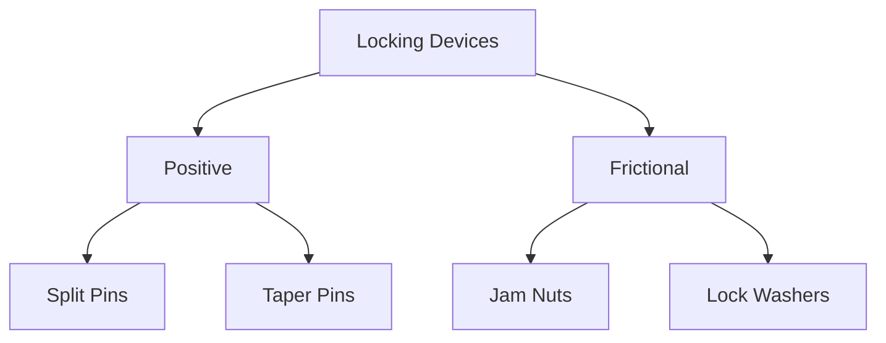
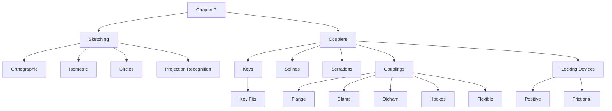

# ME2102 — Chapter 7: Sketching and Couplers

> [!summary] Chapter overview  
> Chapter 7 covers two main areas:
> 
> 1. **Sketching** — interpreting and producing orthographic and isometric representations of engineering objects, including objects containing circular features.
> 2. **Couplers** — methods of connecting mechanical components and preventing unwanted relative motion, including **keys, splines, serrations, couplings, and locking devices**.

The Sketching lecture focuses heavily on visual examples and conversion between orthographic and isometric representations. L07a_Sketching.pdfPDF The Couplers lecture covers keys, splines, serrations, key fits, shaft couplings, and locking devices. L07b_Couplers.pdfPDF

---

# Part A — Sketching

## 7.1 Sketching

Two sketch-sheet formats are shown in the lecture:

- **Orthographic sketch sheet**
    - Uses a square grid.
- **Isometric sketch sheet**
    - Uses an isometric triangular grid.

![[Attachments/Orthographic and Isometric Sketch Sheets.png]]

> [!important]  
> The lecture develops sketching primarily through **worked graphical examples**. The diagrams are therefore important revision material rather than merely illustrations.

---

## 7.2 Orthographic Sketching

### Orthographic representation

The lecture demonstrates how a three-dimensional object can be represented using multiple two-dimensional views.

A worked example shows a complex stepped object together with its corresponding orthographic views.

![[Attachments/Orthographic Projection Example 1.png]]

The views preserve important features of the object such as:

- external boundaries,
- changes in height,
- recesses,
- steps,
- sloping surfaces,
- features that are not directly visible from a particular viewing direction.

### Hidden features

Dashed lines are used in the lecture drawings to represent features that are not directly visible from the selected view.

For example, an edge that is obscured by material in one projection can still be represented using a dashed line.

> [!important]  
> When interpreting an orthographic drawing, do not consider each view independently. Features appearing in one view must correspond consistently to features in the other views.

### Worked orthographic example

A second example shows another irregular three-dimensional object and its corresponding views.

![[Attachments/Orthographic Projection Example 2.png]]

This example is useful for recognising:

- sloping faces,
- cut-out regions,
- changes in object width,
- relationships between the same feature in different views.

---

## 7.3 From Orthographic Views to an Isometric Sketch

The lecture demonstrates how a set of orthographic views can be reconstructed into a three-dimensional isometric representation.

### Example 1

The initial orthographic views contain:

- a rectangular view divided into regions,
- a view containing a long diagonal,
- another rectangular view divided vertically and horizontally.

![[Attachments/Isometric Reconstruction Source 1.png]]

### Construct the overall volume

The reconstruction begins by establishing the overall three-dimensional form using the dimensions implied by the orthographic views.

![[Attachments/Isometric Reconstruction Bounding Form 1.png]]

This provides the basic volume within which the final object exists.

### Transfer the internal geometry

The diagonal and stepped features shown in the orthographic views are then transferred onto the isometric construction.

![[Attachments/Isometric Reconstruction Construction Lines 1.png]]

### Final object

After the required surfaces have been established, unnecessary construction geometry is removed.

![[Attachments/Isometric Reconstruction Final 1.png]]

> [!tip] Sketching workflow  
> The worked example suggests the following practical sequence:
> 
> 1. Read all the orthographic views.
> 2. Establish the overall three-dimensional size and shape.
> 3. Transfer the important edges and changes in geometry.
> 4. Construct inclined surfaces using their endpoints.
> 5. Retain the edges belonging to the actual object.
> 6. Remove unnecessary construction lines.

---

## 7.4 Isometric Sketching — More Complex Example

A second sequence begins with three orthographic views of another object.

![[Attachments/Isometric Reconstruction Source 2.png]]

The isometric construction initially establishes the major block-like regions of the object.

![[Attachments/Isometric Reconstruction Bounding Form 2.png]]

The inclined surfaces are subsequently introduced.

![[Attachments/Isometric Reconstruction Construction Lines 2.png]]

After removing unnecessary construction lines, the final form becomes clear.

![[Attachments/Isometric Reconstruction Final 2.png]]

> [!important]  
> The lecture examples repeatedly use **construction geometry first**, followed by identification of the actual visible object edges.

---

## 7.5 Sketching Examples

The lecture provides several complete examples pairing orthographic projections with their corresponding isometric representations.

### Example — Irregular recessed object

![[Attachments/Sketching Example Recessed Object.png]]

Important features include:

- inclined surfaces,
- recesses,
- changes in height,
- corresponding edges across multiple views.

### Example — Raised sides and central opening

![[Attachments/Sketching Example Raised Sides.png]]

The example combines:

- raised side portions,
- sloping faces,
- a central opening,
- hidden features in the orthographic representation.

### Example — Forked object

![[Attachments/Sketching Example Forked Object.png]]

This example demonstrates an object with:

- multiple projecting arms,
- recessed portions,
- sloped external geometry,
- features whose shapes are clearer when all projections are considered together.

---

# 7.6 Sketching Circles

Circular features require special treatment when represented in an isometric sketch.

The lecture demonstrates the procedure graphically over several slides.

## Circle in an orthographic view

A circular feature is first shown using its:

- vertical centreline,
- horizontal centreline,
- surrounding construction box.

![[Attachments/Circle Construction Orthographic.png]]

## Transfer to the isometric plane

The corresponding construction is transferred onto an isometric plane.

The centre axes become aligned with the relevant isometric directions.

![[Attachments/Circle Construction Isometric Axes.png]]

### Locate construction points

The lecture then identifies points around the circular profile.

![[Attachments/Circle Construction Points.png]]

These points provide references for sketching the curved boundary.

### Complete the isometric circle

A smooth curved profile is drawn through the established points.

![[Attachments/Isometric Circle Completed.png]]

The final result is the isometric representation of the circular feature.

![[Attachments/Orthographic and Isometric Circle.png]]

> [!important]  
> A circle viewed on an isometric plane is represented by the **elliptical-looking profile shown in the lecture**, rather than as the same circular shape seen in the orthographic view.

---

## 7.7 Examples with Circular Features

### Rounded component with central hole

The lecture shows an object containing:

- curved external surfaces,
- a central circular opening,
- straight-sided portions.

![[Attachments/Sketching Circular Example 1.png]]

### Forked component with holes

Another example contains multiple circular holes positioned on different faces.

![[Attachments/Sketching Circular Example 2.png]]

The orthographic views show the position and alignment of the holes, while the isometric representation shows how they appear on the corresponding faces.

### Complex bracket

A further example combines:

- circular openings,
- inclined surfaces,
- vertical plates,
- base features.

![[Attachments/Sketching Circular Example 3.png]]

---

# 7.8 Orthographic–Isometric Recognition

The lecture includes practice questions requiring matching between:

- a three-dimensional model, and
- its corresponding **3rd angle projection**.

One practice question asks:

> **Which model corresponds to the 3rd angle projection on the right?**

![[Attachments/Third Angle Projection Practice.png]]

Another reverses the task:

> **Which 3rd angle projection corresponds to the 3D model to the right?**

![[Attachments/Third Angle Projection Reverse Practice.png]]

### Matching exercise

The lecture then presents six models and six sets of orthographic views.

The supplied answers are:

|Projection|Model|
|---|---|
|1|E|
|2|A|
|3|D|
|4|F|
|5|C|
|6|B|

![[Attachments/Orthographic Matching Answers 1.png]]

A second set gives:

|Projection|Model|
|---|---|
|1|H|
|2|G|
|3|K|
|4|L|
|5|I|
|6|J|

![[Attachments/Orthographic Matching Answers 2.png]]

A larger matching exercise gives:

|Projection|Model|
|---|---|
|A|5|
|B|3|
|C|11|
|D|4|
|E|8|
|F|1|
|G|12|
|H|7|
|I|2|
|J|10|
|K|9|
|L|6|

![[Attachments/Orthographic Matching Answers 3.png]]

> [!tip] Revision focus  
> These matching exercises are particularly useful for practising the ability to mentally reconstruct a **3D form from multiple 2D views**.

---

# Part B — Couplers

## 7.9 Couplers

The lecture groups the following under **Couplers**:

- **Keys**
- **Splines**
- **Serrations**
- **Couplings**
- **Locking Devices**

![[Attachments/Couplers Overview.png]]

---

# 7.10 Keys

## Purpose of a key

A key is an:

> **Object inserted axially between a shaft and hub to prevent the relative rotation of the parts.**

Keys are often made from strong materials such as **steel** to resist:

- high **shear stresses**,
- high **crushing stresses**.

![[Attachments/Key Shaft and Hub.png]]

> [!important]  
> The key prevents **relative rotation between the shaft and hub**.

The lecture also shows a practical assembly in which a key is used to transmit rotation through a shaft-mounted component.

![[Attachments/Key Application.png]]

---

## 7.11 Types of Keys

Several key forms are introduced.

### Parallel key

The lecture shows **parallel keys** with square and rectangular sections.

![[Attachments/Parallel Keys.png]]

The key fits between the:

- shaft,
- hub.

The diagram also shows the corresponding **keyways**.

---

### Gib Head Taper Key

A **Gib Head Taper** key is shown with a basic taper of:

**1 in 100**

The lecture illustrates both:

- square section,
- rectangular section.

![[Attachments/Gib Head Taper Key.png]]

---

### Woodruff Key

The **Woodruff** key has the characteristic curved form shown in the lecture.

![[Attachments/Woodruff Key.png]]

The slide includes:

- sectional representation,
- alternative key form,
- a practical shaft application.

---

### Round Key

Round keys are illustrated in both:

- **plain** form,
- **threaded** form.

![[Attachments/Round Key.png]]

---

### Saddle Key

Two forms are shown:

- **Flat**
- **Hollow**

![[Attachments/Saddle Keys.png]]

---

## Key Types — Visual Checklist

- Parallel
- Gib Head Taper
- Woodruff
- Round
- Saddle

> [!tip] Revision idea  
> Be able to recognise each key type **from its geometry**, since the lecture presents these primarily through diagrams.

---

# 7.12 Splines

The lecture introduces **splines** using examples of matching shaft and hub profiles.

![[Attachments/Splines.png]]

The examples show multiple longitudinal features distributed around the shaft rather than a single key.

---

# 7.13 Serrations

**Serrations** are illustrated alongside splines so that their profiles can be visually compared.

![[Attachments/Splines and Serrations.png]]

The lecture also shows a **conventional representation** for serrations.

> [!important]  
> Be able to visually distinguish the spline and serration forms shown in the lecture.

---

# 7.14 Key Tolerance

The lecture states:

- **No tolerance table for clearance**
- Three qualitative classes of fit are defined.

|Class|Description|
|---|---|
|**Free**|Hub slides over key during operation|
|**Normal**|Minimum fitting, mass production|
|**Close**|Accurate fit is required|

> [!important] Three classes of fit  
> **Free — Normal — Close**

The corresponding practice question asks:

> **How many classes of fit are provided for keys?**

**Answer: 3**

---

# 7.15 Couplings

A **coupling** provides a:

> **Connection between two shafts**

Its purposes described in the lecture are:

- **Transfer rotation from one shaft to another**
- Often useful to **allow relative movement**
- **Allow for misalignment in assembly/function**

---

## 7.16 Flange Coupling

The lecture shows both a three-dimensional representation and a sectional drawing of a **Flange Coupling**.

![[Attachments/Flange Coupling.png]]

The two shafts are connected through mating flange components.

---

## 7.17 Clamp Coupling

The **Clamp Coupling** is shown as a split assembly surrounding the shafts.

![[Attachments/Clamp Coupling.png]]

> [!tip]  
> The clamp coupling is visually distinctive because the coupling body **clamps around the shaft**.

The lecture later uses this image in a recognition question.

---

## 7.18 Oldham Coupling

The lecture shows several representations of an **Oldham Coupling**.

![[Attachments/Oldham Coupling.png]]

A central component is positioned between the two outer coupling members.

The coupling is included among the designs useful when relative movement or misalignment must be accommodated.

---

## 7.19 Hookes Coupling

The lecture introduces the **Hookes Coupling** using examples including:

- single joints,
- double joints,
- teleshafts.

![[Attachments/Hookes Coupling.png]]

The joint permits the connected shaft sections to operate at an angle to one another.

### Rotation behaviour

A practice question asks:

> Which type of coupling will produce **non-uniform output rotation** from **uniform input rotation**?

Options:

- Flange
- Oldham
- Hookes
- Flexible

The answer supported by the lecture is:

**Hookes**

> [!important]  
> **Hookes coupling can produce non-uniform output rotation from uniform input rotation.**

---

## 7.20 Flexible Coupling

Several forms of **Flexible Coupling** are shown.

![[Attachments/Flexible Coupling.png]]

The diagrams illustrate deformation or relative movement within the coupling while joining the shafts.

---

# 7.21 Coupling Recognition

Be able to recognise the four coupling types presented in the lecture:

|Coupling|Key visual feature from lecture|
|---|---|
|**Flange Coupling**|Opposing flange-like discs|
|**Clamp Coupling**|Large split body clamped around shafts|
|**Oldham Coupling**|Central member between two coupling halves|
|**Hookes Coupling**|Articulated joint between angled shafts|
|**Flexible Coupling**|Flexible/deformable connecting structure|

> [!warning]  
> The descriptions above are intended only as visual reminders of the **specific lecture diagrams**, not as additional design definitions.

---

# 7.22 Locking Devices

The purpose of locking devices is:

> **Prevention of threads from disassembly**

The lecture divides locking devices into **two main types**:

1. **Positive**
2. **Frictional**

### Positive locking devices

Examples:

- **Split Pins**
- **Taper Pins**

### Frictional locking devices

Examples:

- **Jam Nuts**
- **Lock Washers**

````

````

> [!important]  
> The two main categories are **Positive** and **Frictional**.

---

# 7.23 Split Pins and Castle Nut

The lecture shows a **split pin** used together with a **castle nut**.

![[Attachments/Split Pin and Castle Nut.png]]

The split pin passes through the assembly as shown in the sectional diagram.

---

# 7.24 Taper and Hitch Pins

The lecture next presents **Taper & Hitch Pins**.

![[Attachments/Taper and Hitch Pins.png]]

The slide shows both:

- engineering drawing representation,
- physical examples.

---

# 7.25 Jam Nuts

The lecture identifies:

**Jam Nuts (Half, Thin)**

The diagram shows:

- **Standard nut**
- **Lock nut**

![[Attachments/Jam Nuts.png]]

The two nuts are shown fitted together on the same threaded member.

---

# 7.26 Spring and Star Lock Washers

Two washer forms are introduced:

- **Spring washer**
- **Star washer**

![[Attachments/Spring and Star Lock Washers.png]]

The slide includes both conventional drawing representations and physical examples.

---

# 7.27 Stiff Nuts and Nylon Insert Nuts

The final locking devices shown are:

- **Stiff Nuts**
- **Nylon Insert Nuts**

![[Attachments/Stiff and Nylon Insert Nuts.png]]

For the stiff nut diagram, the lecture labels:

> **Arms deflected down to grip threads**

For the nylon insert nut, the diagram identifies the:

> **Fibre or nylon ring**

---

# 7.28 Couplers Practice Questions

## Question 1 — Coupling recognition

> Name the type of coupling shown below.

The image is the coupling previously introduced as a:

**Clamp coupling**

![[Attachments/Clamp Coupling Practice.png]]

---

## Question 2 — Key fit

> How many classes of fit are provided for keys?

**Answer: 3**

The three classes are:

- Free
- Normal
- Close

---

## Question 3 — Locking devices

> What are the two main types of locking devices?

**Answer: Frictional & Positive**

---

## Question 4 — Coupling rotation

> Which type of coupling will produce **non-uniform output rotation** from **uniform input rotation**?

**Answer: Hookes**

![[Attachments/Coupling Rotation Practice.png]]

---

# Chapter 7 — Key Connections

````

````

---

# Exam / Revision Checklist

## Sketching

- Can I interpret multiple orthographic views as one 3D object?
- Can I recognise visible and hidden features?
- Can I reconstruct an isometric sketch from orthographic views?
- Can I use construction geometry before drawing the final object?
- Can I interpret inclined surfaces across different views?
- Can I construct the isometric representation of a circular feature?
- Can I match a 3D model to its 3rd angle projection?
- Can I reconstruct a 3D form mentally from its projections?

## Keys

- Do I know the purpose of a key?
- Do I remember that keys resist **shear and crushing stresses**?
- Can I recognise a **Parallel** key?
- Can I recognise a **Gib Head Taper** key?
- Can I recognise a **Woodruff** key?
- Can I recognise a **Round** key?
- Can I recognise **Flat and Hollow Saddle** keys?
- Can I visually distinguish **splines** and **serrations**?

## Key tolerance

- Do I know there are **3 qualitative classes of fit**?
- **Free** — hub slides over key during operation.
- **Normal** — minimum fitting, mass production.
- **Close** — accurate fit is required.

## Couplings

- Do I know that a coupling connects two shafts?
- Do I know that it transfers rotation from one shaft to another?
- Do I know that couplings may allow relative movement?
- Do I know that couplings may allow misalignment in assembly/function?
- Can I recognise a **Flange Coupling**?
- Can I recognise a **Clamp Coupling**?
- Can I recognise an **Oldham Coupling**?
- Can I recognise a **Hookes Coupling**?
- Can I recognise a **Flexible Coupling**?
- Do I remember that **Hookes coupling** can produce non-uniform output rotation from uniform input rotation?

## Locking devices

- Do I know their purpose is the **prevention of threads from disassembly**?
- Can I distinguish **Positive** and **Frictional** locking devices?
- Positive: **Split Pins, Taper Pins**
- Frictional: **Jam Nuts, Lock Washers**
- Can I recognise a **Split Pin & Castle Nut**?
- Can I recognise **Taper & Hitch Pins**?
- Can I recognise **Jam Nuts**?
- Can I recognise **Spring & Star Lock Washers**?
- Can I recognise **Stiff Nuts & Nylon Insert Nuts**?

> [!summary] Chapter 7 core points
> 
> - **Sketching:** use orthographic views to understand the complete geometry of a component and reconstruct its isometric form.
> - **Circular features:** the lecture uses construction axes and reference points to construct their isometric appearance.
> - **Keys:** inserted axially between a shaft and hub to prevent relative rotation.
> - **Key fits:** **Free, Normal, Close**.
> - **Couplings:** connect two shafts and transfer rotation while some designs accommodate relative movement or misalignment.
> - **Hookes coupling:** can produce **non-uniform output rotation from uniform input rotation**.
> - **Locking devices:** prevent threads from disassembly and are divided into **Positive** and **Frictional** types.