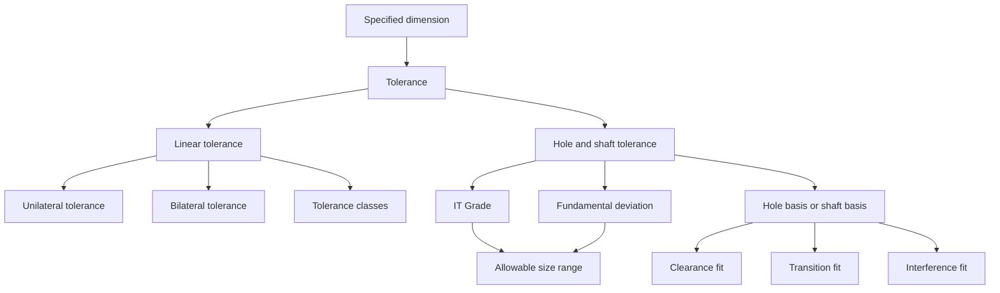

# ME2102 — Chapter 5: Limit Tolerance and Fit

> [!summary] Chapter overview
> Chapter 5 introduces **tolerance** as the permissible deviation from specifications, then develops **linear tolerances**, **unilateral and bilateral tolerances**, **cumulative tolerance**, **tolerance classes**, **International Tolerance (IT) Grades**, **fundamental deviation (FD)**, **hole basis and shaft basis**, and the standard **clearance, transition, and interference fits**. The worked examples use the ME2102 tolerance chart to determine allowable hole and shaft diameter ranges.

---

## 5.1 Limit Tolerance

### Tolerance

The lecture gives four reasons for specifying tolerance:

- **Permissible deviation from specifications**
- **Mass-produced parts yield variability**
- **Provides specification priority guarantees**
- **Ensures parts can fit together**

Tolerance is shown for both **linear** dimensions and **holes / shafts**.

![[Attachments/Tolerance_Linear_and_Hole_Shaft.png]]

> [!important]
> A specified dimension does not always represent one exact manufactured size. The tolerance gives the allowable variation around or from that specified dimension.

### Tolerance and manufacturing

The lecture compares typical component size with achievable accuracy and shows that different manufacturing processes operate over different accuracy ranges.

![[Attachments/Manufacturing_Process_Accuracy.png]]

Processes shown include:

- sandcasting
- extrusion
- machining
- grinding

The IT Grade chart later relates manufacturing processes to the IT Grades they can achieve.

---

## 5.2 Linear Tolerance

The notes show a linear dimension in two equivalent forms:

- **Limits**
- **Offsets**

For the example:

$$
41 \pm 0.2
$$

has limits

$$
40.8
$$

and

$$
41.2.
$$

### Unilateral tolerance

**Variation is permitted only in one direction from specified dimension.**

Examples in the notes include:

$$
60^{+0.05}_{-0}
$$

with limits

$$
60.00
$$

to

$$
60.05,
$$

and

$$
57.15^{+0.00}_{-0.13}
$$

with limits

$$
57.02 - 57.15.
$$

Another example is

$$
16.51^{+0.08}_{-0.00}
$$

with limits

$$
16.51 - 16.59.
$$

![[Attachments/Unilateral_Tolerance.png]]

> [!note]
> In a unilateral tolerance, the allowable variation is on only one side of the **Basic Size**.

### Bilateral tolerance

**Variation is permitted in both directions from specified dimension.**

Examples shown are:

$$
50 \pm 0.3
$$

and

$$
57.2 \pm 1.5.
$$

The notes also show unequal variation in both directions:

$$
57.2^{+0.8}_{-1.5}
$$

with limits

$$
55.7 - 58.0.
$$

![[Attachments/Bilateral_Tolerance.png]]

> [!important]
> Bilateral tolerance allows variation on both sides of the specified dimension. The positive and negative amounts do not have to be equal.

---

## 5.3 Cumulative Tolerance

The lecture contrasts **Cumulative Tolerances** with **Ordinate Dimensioning**.

![[Attachments/Cumulative_vs_Ordinate_Dimensioning.png]]

The cumulative-tolerance example dimensions consecutive steps separately:

- $9.95 - 10.00$
- $9.95 - 10.00$
- $9.95 - 10.00$

The ordinate-dimensioning example references dimensions from a common end and shows:

- $9.95 - 10.00$
- $19.95 - 20.00$
- $29.95 - 30.00$

> [!warning]
> The slide labels cumulative tolerances as **Poor** and contrasts them with ordinate dimensioning.

---

## 5.4 Tolerance Classes

The lecture uses **ISO 2768** tolerance classes:

- **Fine (f)**
- **Medium (m)**
- **Coarse (c)**
- **Very coarse (v)**

![[Attachments/ISO2768_Tolerance_Classes.png]]

The permissible deviation depends on:

1. the **basic dimension range**, and
2. the selected **tolerance class**.

### ISO 2768 table from the notes

| Above (mm) | Up to (mm) | Fine (f) | Medium (m) | Coarse (c) | Very coarse (v) |
|---:|---:|---:|---:|---:|---:|
| 0.5 | 3 | $\pm 0.05$ | $\pm 0.1$ | $\pm 0.2$ | |
| 3 | 6 | $\pm 0.05$ | $\pm 0.1$ | $\pm 0.3$ | $\pm 0.5$ |
| 6 | 30 | $\pm 0.1$ | $\pm 0.2$ | $\pm 0.5$ | $\pm 1$ |
| 30 | 120 | $\pm 0.15$ | $\pm 0.3$ | $\pm 0.8$ | $\pm 1.5$ |
| 120 | 400 | $\pm 0.2$ | $\pm 0.5$ | $\pm 1.2$ | $\pm 2.5$ |
| 400 | 1000 | $\pm 0.3$ | $\pm 0.8$ | $\pm 2$ | $\pm 4$ |
| 1000 | 2000 | $\pm 0.5$ | $\pm 1.2$ | $\pm 3$ | $\pm 6$ |

### Practice pattern

For a question such as **Coarse 50**:

1. Locate the basic dimension range containing $50$.
2. Read the value under **Coarse (c)**.
3. Apply the permitted variation to the specified dimension.
4. Select the requested minimum or maximum length.

---

## 5.5 International Tolerance (IT) Grade

The tolerance chart lists **International Tolerance** values in microns for IT Grades:

$$
5,\ 6,\ 7,\ 8,\ 9,\ 10,\ 11.
$$

The chart shows that the International Tolerance value depends on both:

- the **basic dimension range**, and
- the **IT Grade**.

The lecture also shows which IT Grades are achievable by different manufacturing processes.

![[Attachments/IT_Grades_Manufacturing_Processes.png]]

Processes shown include:

- Lapping and Honing
- Cylindrical Grinding
- Surface Grinding
- Diamond Turning
- Diamond Boring
- Broaching
- Reaming
- Powder Metal - Sizes
- Turning
- Powder Metal - Sintered
- Boring
- Milling
- Planing and Shaping
- Drilling
- Punching
- Die Casting

> [!tip] Reading an IT Grade
> First identify the correct **basic dimension** row. Then move to the required **IT Grade** column and read the International Tolerance value.

---

## 5.6 Hole / Shaft Tolerance

A hole or shaft tolerance designation combines information about the allowable size range.

The notes give the example:

$$
\varnothing 25g6 = \varnothing 24.980 - \varnothing 24.993.
$$

The tolerance illustration identifies:

- **Basic Size**
- **Max Size**
- **Min Size**
- **Upper Deviation**
- **Lower Deviation**
- **Shaft Tolerance**
- **Hole Tolerance**
- **IT Grades**
- **Fundamental Deviations**

![[Attachments/Hole_Shaft_Tolerance_Illustration.png]]

### IT Grade and Fundamental Deviation

The lecture separates the two parts:

- **IT Grade** gives the tolerance amount.
- **Fundamental Deviation (FD)** locates the tolerance relative to the **Basic size**.

The fundamental-deviation chart uses letters including:

$$
c,\ d,\ f,\ g,\ h,\ k,\ n,\ p,\ s,\ u
$$

for shafts, with corresponding hole positions shown on the chart.

![[Attachments/Fundamental_Deviation.png]]

> [!important]
> The worked examples use the **FD** and the **IT Grade** together to obtain the minimum and maximum allowable diameters.

---

## 5.7 Hole Basis and Shaft Basis

### Hole Basis

The lecture shows a **Hole Basis** arrangement for:

- **C — clearance**
- **T — transition**
- **I — interference**

![[Attachments/Hole_Basis.png]]

The hole-basis fit chart shown in the lecture uses:

| Fit group | Fit | Hole | Shaft |
|---|---|---|---|
| Clearance Fits | Loose | H11 | c11 |
| Clearance Fits | Free | H9 | d9 |
| Clearance Fits | Close | H8 | f7 |
| Clearance Fits | Sliding | H7 | g6 |
| Precision Fit | Location | H7 | h6 |
| Transition Fits | Light | H7 | k6 |
| Transition Fits | Heavy | H7 | n6 |
| Interference Fits | Location | H7 | p6 |
| Interference Fits | Drive | H7 | s6 |
| Interference Fits | Force | H7 | u6 |

![[Attachments/Hole_Basis_Fits.png]]

### Shaft Basis

The lecture also shows a **Shaft Basis** arrangement, where the shaft is used as the basis and the hole tolerance position changes.

![[Attachments/Shaft_Basis.png]]

---

## 5.8 Standard Fits

The notes divide standard fits into three main groups:

- **Clearance**
- **Transition**
- **Interference**

![[Attachments/Standard_Fits.png]]

### Clearance fit

The clearance-fit diagram shows **Minimum Clearance** and **Maximum Clearance**.

The hole-basis chart places these fit types under clearance:

- Loose
- Free
- Close
- Sliding
- Location under Precision Fit

### Transition fit

The transition-fit diagram includes both:

- **Maximum Interference**
- **Maximum Clearance**

The hole-basis chart lists:

- Light
- Heavy

under Transition Fits.

### Interference fit

The interference-fit diagram shows:

- **Minimum Interference**
- **Maximum Interference**

The hole-basis chart lists:

- Location
- Drive
- Force

under Interference Fits.

---

## 5.9 Using the Tolerance Chart

The examples in the lecture follow a consistent procedure.

### Procedure

1. Identify the **basic diameter**.
2. Identify the required **fit**.
3. Use the fit chart to determine the hole and shaft designations.
4. Use the basic-dimension row in the tolerance chart.
5. Read the required **FD**.
6. Read the required **IT Grade**.
7. Use the values to determine the **Min $\varnothing$** and **Max $\varnothing$**.

> [!tip] Exam workflow
> For fit questions, separate the calculation into **hole** and **shaft**. The lecture examples explicitly find the FD and IT Grade for each before writing the allowable diameter range.

---

## 5.10 Worked Examples

### Example — $\varnothing 90$ Sliding Fit

The question asks for the allowable diameter range for the **hole and shaft** with a

$$
\varnothing 90
$$

Sliding Fit.

#### Hole

The notes give:

$$
FD\ H = 0.000\text{ mm}
$$

$$
IT\ 7 = 0.035\text{ mm}
$$

$$
Min\ \varnothing = 90.000\text{ mm}
$$

$$
Max\ \varnothing = 90.035\text{ mm}
$$

![[Attachments/Example_90_Sliding_Fit_Hole.png]]

#### Shaft

The notes give:

$$
FD\ g = -0.012\text{ mm}
$$

$$
IT\ 6 = 0.022\text{ mm}
$$

$$
Min\ \varnothing = 89.966\text{ mm}
$$

$$
Max\ \varnothing = 89.988\text{ mm}
$$

![[Attachments/Example_90_Sliding_Fit_Shaft.png]]

---

### Example — $\varnothing 25$ Sliding Fit

#### Hole

The notes give:

$$
FD\ H = 0.000\text{ mm}
$$

$$
IT\ 7 = 0.021\text{ mm}
$$

$$
Min\ \varnothing = 25.00\text{ mm}
$$

$$
Max\ \varnothing = 25.021\text{ mm}
$$

![[Attachments/Example_25_Sliding_Fit_Hole.png]]

#### Shaft

The notes give:

$$
FD\ g = -0.007\text{ mm}
$$

$$
IT\ 6 = 0.013\text{ mm}
$$

$$
Min\ \varnothing = 24.980\text{ mm}
$$

$$
Max\ \varnothing = 24.993\text{ mm}
$$

![[Attachments/Example_25_Sliding_Fit_Shaft.png]]

> [!important]
> This matches the earlier limit shown in the lecture:
>
> $$
> \varnothing 25g6 = \varnothing 24.980 - \varnothing 24.993.
> $$

---

### Example — $\varnothing 12$ Free Fit

#### Hole

The notes give:

$$
FD\ H = 0.000\text{ mm}
$$

$$
IT\ 9 = 0.043\text{ mm}
$$

$$
Min\ \varnothing = 12.00\text{ mm}
$$

$$
Max\ \varnothing = 12.043\text{ mm}
$$

![[Attachments/Example_12_Free_Fit_Hole.png]]

#### Shaft

The notes give:

$$
FD\ d = -0.050\text{ mm}
$$

$$
IT\ 9 = 0.043\text{ mm}
$$

$$
Min\ \varnothing = 11.907\text{ mm}
$$

$$
Max\ \varnothing = 11.950\text{ mm}
$$

![[Attachments/Example_12_Free_Fit_Shaft.png]]

---

## 5.11 Practice Questions Shown in the Lecture

The lecture ends with practice questions on:

- minimum length for **Coarse 50**
- maximum length for **Fine 400**
- identifying a process that cannot achieve **IT Grade 7**
- maximum diameter for a $\varnothing 35$ hole designed for a **Loose Fit**
- minimum diameter for a $\varnothing 75$ shaft designed for a **Heavy Fit**
- maximum diameter allowable for $\varnothing 200\ s9$
- maximum interference for a $\varnothing 20$ **Force Fit**

These questions test the same chart-reading procedure used in the worked examples.

---

## Chapter 5 — Key Connections

## Exam Checklist

- [ ] Can I explain why tolerance is specified?
- [ ] Can I distinguish **limits** from **offsets**?
- [ ] Can I distinguish **unilateral** from **bilateral** tolerance?
- [ ] Can I read the **ISO 2768** tolerance-class table?
- [ ] Can I identify the required **basic dimension range**?
- [ ] Can I read an **IT Grade** from the tolerance chart?
- [ ] Can I read a **Fundamental Deviation (FD)** from the tolerance chart?
- [ ] Can I distinguish **Hole Basis** from **Shaft Basis**?
- [ ] Can I identify **clearance**, **transition**, and **interference** fits?
- [ ] Can I obtain the hole and shaft designations for a named fit?
- [ ] Can I calculate the **Min $\varnothing$** and **Max $\varnothing$** using the chart values?
- [ ] Can I follow the same procedure for a new basic diameter and fit?

> [!summary] Core items to remember
> - Tolerance is the **permissible deviation from specifications**.
> - **Unilateral Tolerance:** variation is permitted only in one direction from specified dimension.
> - **Bilateral Tolerances:** variation is permitted in both directions from specified dimension.
> - **ISO 2768** gives Fine, Medium, Coarse, and Very coarse tolerance classes.
> - **IT Grade** gives the International Tolerance value for the selected basic dimension range.
> - **FD** gives the Fundamental Deviation used with the IT Grade.
> - Standard fits are **Clearance**, **Transition**, and **Interference**.
> - For tolerance-chart questions: identify the fit, find the designation, read **FD** and **IT**, then obtain the allowable diameter range.
